# 🌐 ft_ping - Implementación del Comando Ping en C

<div align="center">


**Una implementación completa y educativa del comando UNIX `ping` desde cero**

[Características](#-características) • [Instalación](#-instalación) • [Uso](#-uso) • [Teoría](#-fundamentos-teóricos) • [Implementación](#-implementación)

</div>

---

## 📋 Tabla de Contenidos

- [Introducción](#-introducción)
- [Características](#-características)
- [Requisitos](#-requisitos)
- [Instalación](#-instalación)
- [Uso](#-uso)
- [Fundamentos Teóricos](#-fundamentos-teóricos)
  - [¿Qué es ICMP?](#-qué-es-icmp)
  - [Estructura del Protocolo ICMP](#-estructura-del-protocolo-icmp)
  - [Tipos de Mensajes ICMP](#-tipos-de-mensajes-icmp)
  - [¿Cómo Funciona Ping?](#-cómo-funciona-ping)
  - [Sockets RAW](#-sockets-raw)
  - [Resolución DNS](#-resolución-dns)
  - [Cálculo de Checksums](#-cálculo-de-checksums)
  - [Métricas de Red](#-métricas-de-red)
- [Implementación del Proyecto](#-implementación-del-proyecto)
  - [Arquitectura](#arquitectura)
  - [Diagrama de Flujo](#diagrama-de-flujo-completo)
  - [Estructuras de Datos](#estructuras-de-datos)
  - [Módulos y Funciones](#módulos-y-funciones)
  - [Casos de Borde](#casos-de-borde)
- [Ejemplos de Uso](#-ejemplos-de-uso)
- [Referencias](#-referencias)

---

## 🎯 Introducción

**ft_ping** es una reimplementación educativa del comando UNIX `ping` escrita en C puro. Este proyecto no solo replica la funcionalidad del ping estándar, sino que sirve como una herramienta didáctica completa para comprender los protocolos de red de bajo nivel, particularmente ICMP (Internet Control Message Protocol).

El comando `ping` es una de las herramientas de diagnóstico de red más fundamentales y ampliamente utilizadas. Permite verificar la conectividad entre dos hosts en una red IP y medir la latencia (tiempo de ida y vuelta) de los paquetes.

---

## ✨ Características

### Características Principales
- ✅ **Envío de paquetes ICMP Echo Request** (Type 8)
- ✅ **Recepción y análisis de ICMP Echo Reply** (Type 0)
- ✅ **Cálculo de RTT** (Round Trip Time) en milisegundos
- ✅ **Estadísticas detalladas**: min/avg/max/mdev
- ✅ **Resolución DNS** de hostnames a direcciones IP
- ✅ **Soporte para IPv4**
- ✅ **Manejo de errores ICMP**: Destination Unreachable, Time Exceeded, etc.
- ✅ **Gestión de señales** (SIGINT para Ctrl+C)

### Opciones Implementadas
| Flag | Descripción |
|------|-------------|
| `-v, --verbose` | Modo verbose con salida detallada |
| `-c <count>` | Limita el número de paquetes a enviar |
| `-s <size>` | Define el tamaño del payload (por defecto 56 bytes) |
| `--ttl <value>` | Establece el Time To Live (0-255) |
| `-i <interval>` | Intervalo en segundos entre paquetes |
| `-W <timeout>` | Timeout en segundos para esperar respuesta |
| `-f` | Modo flood (envío rápido sin delays) |
| `-h, --help` | Muestra la ayuda |

---

## 🔧 Requisitos

- **Sistema Operativo**: Linux/Unix
- **Compilador**: GCC o Clang con soporte C99
- **Permisos**: Root o CAP_NET_RAW (para crear raw sockets)
- **Librerías**: 
  - `libc` estándar
  - Headers de red: `<netinet/ip.h>`, `<netinet/ip_icmp.h>`

---

## 📦 Instalación

```bash
# Clonar el repositorio
git clone https://github.com/rdelicado/ft_ping.git
cd ft_ping

# Compilar el proyecto
make

# Ejecutar (requiere permisos de root)
sudo ./ft_ping google.com
```

### Compilación con Flags Específicos
```bash
# Compilación con debugging
make debug

# Limpiar archivos objeto
make clean

# Limpiar todo (incluido binario)
make fclean

# Recompilar desde cero
make re
```

---

## 🚀 Uso

### Sintaxis Básica
```bash
sudo ./ft_ping [opciones] <destino>
```

### Ejemplos Básicos

```bash
# Ping a una IP
sudo ./ft_ping 8.8.8.8

# Ping a un hostname
sudo ./ft_ping google.com

# Enviar 5 paquetes y terminar
sudo ./ft_ping -c 5 google.com

# Modo verbose
sudo ./ft_ping -v 8.8.8.8

# Ping con TTL personalizado
sudo ./ft_ping --ttl 64 google.com

# Ping con payload de 1000 bytes
sudo ./ft_ping -s 1000 google.com

# Intervalo de 2 segundos entre paquetes
sudo ./ft_ping -i 2 google.com
```

### Salida Esperada
```
PING google.com (142.250.185.46) 56(84) bytes of data.
64 bytes from 142.250.185.46: icmp_seq=1 ttl=117 time=15.3 ms
64 bytes from 142.250.185.46: icmp_seq=2 ttl=117 time=14.8 ms
64 bytes from 142.250.185.46: icmp_seq=3 ttl=117 time=15.1 ms
^C
--- google.com ping statistics ---
3 packets transmitted, 3 received, 0% packet loss, time 2004ms
rtt min/avg/max/mdev = 14.800/15.067/15.300/0.208 ms
```

---

## 📚 Fundamentos Teóricos

### 🌍 ¿Qué es ICMP?

**ICMP (Internet Control Message Protocol)** es un protocolo de la capa de red del modelo OSI (capa 3) utilizado para enviar mensajes de control y error entre dispositivos de red. Definido originalmente en [RFC 792](https://tools.ietf.org/html/rfc792), ICMP es parte integral de la suite de protocolos de Internet (TCP/IP).

#### Características Principales de ICMP:
- 📨 **No orientado a conexión**: No establece una conexión antes de enviar datos
- ⚠️ **Protocolo de soporte**: No transporta datos de usuario, solo mensajes de control
- 🔢 **Número de protocolo**: 1 (en el header IP)
- 🎯 **Propósito**: Diagnóstico, notificación de errores y control de flujo

#### ¿Por qué existe ICMP?
IP (Internet Protocol) es un protocolo "best-effort" (mejor esfuerzo), lo que significa que no garantiza la entrega de paquetes. ICMP proporciona un mecanismo para que los routers y hosts notifiquen problemas en la entrega de datagramas IP.

---

### 📦 Estructura del Protocolo ICMP

#### Formato General del Mensaje ICMP

Un mensaje ICMP consta de un header IP seguido de un header ICMP y datos opcionales:

```
┌─────────────────────────────────────────────────────────┐
│                    IP HEADER (20 bytes)                 │
│  Version | IHL | ToS | Total Length | Identification   │
│  Flags | Fragment Offset | TTL | Protocol | Checksum   │
│  Source IP Address | Destination IP Address            │
├─────────────────────────────────────────────────────────┤
│                   ICMP HEADER (8+ bytes)                │
│  ┌──────────┬──────────┬─────────────────────────────┐ │
│  │ Type (8) │ Code (8) │     Checksum (16)           │ │
│  ├──────────┴──────────┴─────────────────────────────┤ │
│  │              Rest of Header (variable)            │ │
│  │         (depende del tipo de mensaje)             │ │
│  └───────────────────────────────────────────────────┘ │
├─────────────────────────────────────────────────────────┤
│                    ICMP DATA (variable)                 │
│         (contenido depende del tipo de mensaje)         │
└─────────────────────────────────────────────────────────┘
```

#### Campos del Header ICMP:

| Campo | Tamaño | Descripción |
|-------|--------|-------------|
| **Type** | 8 bits | Tipo de mensaje ICMP (ej: 8=Echo Request, 0=Echo Reply) |
| **Code** | 8 bits | Subtipo que proporciona información adicional |
| **Checksum** | 16 bits | Checksum para verificar integridad del mensaje ICMP |
| **Rest of Header** | 32 bits | Contenido variable según el tipo de mensaje |
| **Data** | Variable | Datos adicionales del mensaje |

#### Estructura Específica de Echo Request/Reply:

```
 0                   1                   2                   3
 0 1 2 3 4 5 6 7 8 9 0 1 2 3 4 5 6 7 8 9 0 1 2 3 4 5 6 7 8 9 0 1
┌───────────────────────────────────────────────────────────────┐
│     Type      │     Code      │          Checksum             │
├───────────────────────────────────────────────────────────────┤
│         Identifier            │        Sequence Number        │
├───────────────────────────────────────────────────────────────┤
│                        Data (Payload)                         │
│                            ...                                │
└───────────────────────────────────────────────────────────────┘
```

**Campos específicos de Echo:**
- **Identifier**: Identifica la sesión de ping (normalmente el PID del proceso)
- **Sequence Number**: Número de secuencia que incrementa con cada paquete
- **Data**: Payload opcional (normalmente contiene timestamp y datos de relleno)

---

### 📋 Tipos de Mensajes ICMP

ICMP define múltiples tipos de mensajes. Los más relevantes para `ping` son:

#### Mensajes Principales:

| Type | Code | Nombre | Propósito |
|------|------|--------|-----------|
| **0** | 0 | Echo Reply | Respuesta a Echo Request |
| **3** | 0-15 | Destination Unreachable | Host/red/puerto inalcanzable |
| **4** | 0 | Source Quench | Control de flujo (obsoleto) |
| **5** | 0-3 | Redirect | Ruta alternativa disponible |
| **8** | 0 | Echo Request | Solicitud de eco (ping) |
| **11** | 0-1 | Time Exceeded | TTL expirado en tránsito |
| **12** | 0-2 | Parameter Problem | Error en header IP |
| **13** | 0 | Timestamp Request | Solicitud de timestamp |
| **14** | 0 | Timestamp Reply | Respuesta de timestamp |

#### Códigos de Destination Unreachable (Type 3):

| Code | Significado |
|------|-------------|
| 0 | Network Unreachable |
| 1 | Host Unreachable |
| 2 | Protocol Unreachable |
| 3 | Port Unreachable |
| 4 | Fragmentation Needed but DF Set |
| 5 | Source Route Failed |
| 6 | Destination Network Unknown |
| 7 | Destination Host Unknown |

#### Códigos de Time Exceeded (Type 11):

| Code | Significado |
|------|-------------|
| 0 | TTL Expired in Transit |
| 1 | Fragment Reassembly Time Exceeded |

---

### ⚡ ¿Cómo Funciona Ping?

El comando `ping` utiliza mensajes ICMP Echo Request y Echo Reply para determinar si un host remoto está accesible y medir la latencia de la red.

#### Proceso Paso a Paso:

```
┌──────────┐                                      ┌──────────┐
│  Host A  │                                      │  Host B  │
│ (Origen) │                                      │ (Destino)│
└─────┬────┘                                      └────┬─────┘
      │                                                │
      │  1. Construcción de Echo Request               │
      │     - Type: 8, Code: 0                         │
      │     - ID: PID del proceso                      │
      │     - Seq: Número de secuencia                 │
      │     - Timestamp: Hora de envío                 │
      │                                                │
      │  2. Envío del paquete ICMP                     │
      ├────────────────────────────────────────────────>
      │         Echo Request (Type 8)                  │
      │                                                │
      │                                                │ 3. Recepción
      │                                                │ 4. Procesamiento
      │                                                │ 5. Construcción Reply
      │                                                │    - Type: 0, Code: 0
      │                                                │    - Mismo ID y Seq
      │                                                │    - Copia del payload
      │         Echo Reply (Type 0)                    │
      <────────────────────────────────────────────────┤
      │  6. Recepción de respuesta                     │
      │                                                │
      │  7. Cálculo de RTT                             │
      │     RTT = T_recv - T_send                      │
      │                                                │
      │  8. Actualización de estadísticas              │
      │     - packets_received++                       │
      │     - min/max/avg/mdev                         │
      │                                                │
      ▼  9. Esperar intervalo y repetir               ▼
```

#### Detalles del Proceso:

1. **Construcción del Paquete**:
   - Se crea un header ICMP con Type=8 (Echo Request) y Code=0
   - Se asigna un identificador único (normalmente el PID)
   - Se incrementa el número de secuencia
   - Se añade un payload (datos de relleno)
   - Se calcula el checksum del mensaje ICMP completo

2. **Envío**:
   - El paquete se envía usando un raw socket
   - El kernel añade el header IP automáticamente
   - El paquete viaja a través de la red, pasando por routers

3. **Tránsito**:
   - Cada router decrementa el TTL (Time To Live)
   - Si TTL llega a 0, el router envía un ICMP Time Exceeded
   - Si el destino es inalcanzable, se envía Destination Unreachable

4. **Recepción por el Destino**:
   - El host destino recibe el Echo Request
   - Procesa el mensaje y construye un Echo Reply
   - Copia el ID, secuencia y payload del Request
   - Cambia Type a 0 (Echo Reply)
   - Recalcula el checksum

5. **Recepción de la Respuesta**:
   - El host origen recibe el Echo Reply
   - Valida que el ID coincida con el PID
   - Valida que la secuencia coincida
   - Calcula el RTT usando timestamps
   - Actualiza estadísticas

6. **Estadísticas**:
   - Se mantienen contadores de paquetes enviados/recibidos
   - Se calculan min/max/avg/mdev del RTT
   - Se calcula el porcentaje de pérdida de paquetes

---

### 🔌 Sockets RAW

Para enviar y recibir paquetes ICMP directamente, `ping` utiliza **raw sockets**, que permiten acceso directo a protocolos de nivel de red.

#### ¿Qué son los Raw Sockets?

Un **raw socket** es un tipo especial de socket que permite:
- Acceso directo a protocolos de capa de red (Layer 3)
- Construcción manual de headers de protocolo
- Recepción de paquetes sin procesar
- Implementación de protocolos personalizados

#### Creación de un Raw Socket para ICMP:

```c
int sockfd = socket(AF_INET, SOCK_RAW, IPPROTO_ICMP);
```

**Parámetros**:
- `AF_INET`: Familia de direcciones IPv4
- `SOCK_RAW`: Tipo de socket raw
- `IPPROTO_ICMP`: Protocolo ICMP (número 1)

#### Privilegios Necesarios:

Los raw sockets requieren privilegios especiales por razones de seguridad:
- **Root (UID 0)**: Acceso completo
- **CAP_NET_RAW**: Capability específica en Linux

```bash
# Ejecutar con sudo
sudo ./ft_ping google.com

# O dar capability al binario (persiste)
sudo setcap cap_net_raw+ep ./ft_ping
./ft_ping google.com
```

#### Configuración del Socket:

```c
// Configurar timeout de recepción
struct timeval tv;
tv.tv_sec = 1;
tv.tv_usec = 0;
setsockopt(sockfd, SOL_SOCKET, SO_RCVTIMEO, &tv, sizeof(tv));

// Configurar TTL
int ttl = 64;
setsockopt(sockfd, IPPROTO_IP, IP_TTL, &ttl, sizeof(ttl));
```

#### Envío y Recepción:

```c
// Envío (sendto)
struct sockaddr_in dest_addr;
// ... configurar dest_addr ...
sendto(sockfd, icmp_packet, packet_size, 0,
       (struct sockaddr*)&dest_addr, sizeof(dest_addr));

// Recepción (recvfrom)
char buffer[1024];
struct sockaddr_in src_addr;
socklen_t addr_len = sizeof(src_addr);
recvfrom(sockfd, buffer, sizeof(buffer), 0,
         (struct sockaddr*)&src_addr, &addr_len);
```

---

### 🔍 Resolución DNS

Antes de enviar un ping, necesitamos convertir hostnames (como `google.com`) a direcciones IP.

#### Función getaddrinfo():

La función moderna y recomendada para resolución de nombres es `getaddrinfo()`:

```c
struct addrinfo hints, *result;

memset(&hints, 0, sizeof(hints));
hints.ai_family = AF_INET;        // IPv4
hints.ai_socktype = SOCK_RAW;     // Raw socket
hints.ai_protocol = IPPROTO_ICMP; // ICMP

int ret = getaddrinfo("google.com", NULL, &hints, &result);
if (ret == 0) {
    struct sockaddr_in *ipv4 = (struct sockaddr_in*)result->ai_addr;
    // ipv4->sin_addr contiene la IP
    freeaddrinfo(result);
}
```

#### Proceso de Resolución DNS:

```
┌──────────────┐         ┌──────────────┐         ┌──────────────┐
│   Cliente    │         │ DNS Resolver │         │ DNS Server   │
│  (ft_ping)   │         │   (Local)    │         │  (Externo)   │
└──────┬───────┘         └──────┬───────┘         └──────┬───────┘
       │                        │                        │
       │ 1. getaddrinfo()       │                        │
       │   "google.com"         │                        │
       ├───────────────────────>│                        │
       │                        │                        │
       │                        │ 2. DNS Query           │
       │                        │   A record for         │
       │                        │   google.com           │
       │                        ├───────────────────────>│
       │                        │                        │
       │                        │ 3. DNS Response        │
       │                        │   142.250.185.46       │
       │                        <────────────────────────┤
       │                        │                        │
       │ 4. Retorno             │                        │
       │   struct addrinfo      │                        │
       <───────────────────────┤                        │
       │                        │                        │
       ▼                        ▼                        ▼
```

#### Manejo de IPs Directas:

Si el destino ya es una IP, podemos usar `inet_pton()` para validarla:

```c
struct in_addr addr;
if (inet_pton(AF_INET, "8.8.8.8", &addr) == 1) {
    // Es una IP válida
}
```

---

### 🧮 Cálculo de Checksums

El checksum ICMP es crucial para verificar la integridad del mensaje.

#### Algoritmo del Checksum:

El checksum ICMP es un complemento a uno de la suma de complemento a uno de todos los words de 16 bits:

```c
uint16_t calculate_checksum(void *data, int len) {
    uint16_t *buf = (uint16_t *)data;
    uint32_t sum = 0;
    
    // Sumar todos los words de 16 bits
    for (; len > 1; len -= 2) {
        sum += *buf++;
    }
    
    // Si queda un byte impar, añadirlo
    if (len == 1) {
        sum += *(uint8_t *)buf;
    }
    
    // Plegar los carries de 32 bits a 16 bits
    while (sum >> 16) {
        sum = (sum & 0xFFFF) + (sum >> 16);
    }
    
    // Retornar el complemento a uno
    return ~sum;
}
```

#### Proceso Paso a Paso:

1. **Inicializar checksum a 0** en el header ICMP
2. **Sumar** todos los words de 16 bits del mensaje
3. **Plegar** los carries (bits > 16) sumándolos al resultado
4. **Complementar** el resultado (invertir bits)
5. **Colocar** el checksum en el header

#### Verificación:

Al recibir un paquete, se recalcula el checksum incluyendo el checksum recibido. Si el resultado es 0xFFFF o 0x0000, el paquete es válido.

---

### 📊 Métricas de Red

#### RTT (Round Trip Time)

El **RTT** es el tiempo que tarda un paquete en ir del origen al destino y volver:

```c
struct timeval send_time, recv_time;

// Antes de enviar
gettimeofday(&send_time, NULL);

// ... enviar y recibir ...

// Después de recibir
gettimeofday(&recv_time, NULL);

// Calcular RTT en milisegundos
double rtt = (recv_time.tv_sec - send_time.tv_sec) * 1000.0 +
             (recv_time.tv_usec - send_time.tv_usec) / 1000.0;
```

#### Estadísticas de Ping:

Al final, ping muestra estadísticas calculadas:

**1. Packet Loss (Pérdida de Paquetes)**:
```
loss_percent = ((packets_sent - packets_received) / packets_sent) * 100
```

**2. RTT Mínimo**:
```
rtt_min = min(rtt_1, rtt_2, ..., rtt_n)
```

**3. RTT Promedio**:
```
rtt_avg = sum(rtt_i) / packets_received
```

**4. RTT Máximo**:
```
rtt_max = max(rtt_1, rtt_2, ..., rtt_n)
```

**5. Mdev (Mean Deviation - Desviación Estándar)**:
```
variance = (sum(rtt_i²) / n) - (rtt_avg)²
mdev = sqrt(variance)
```

La **mdev** indica la variabilidad o "jitter" de la red. Valores bajos indican consistencia.

#### TTL (Time To Live):

El **TTL** es un contador que limita la vida de un paquete en la red:
- Se establece en el origen (típicamente 64 o 128)
- Cada router lo decrementa en 1
- Si llega a 0, el router descarta el paquete y envía ICMP Time Exceeded
- Permite inferir la distancia en "hops" al destino

```
TTL inicial = 64
TTL recibido = 54
Número de hops = 64 - 54 = 10 routers
```

---

## 🔨 Implementación del Proyecto

### Arquitectura

El proyecto `ft_ping` está estructurado de forma modular para facilitar el mantenimiento y la comprensión:

```
ft_ping/
├── include/
│   ├── ft_ping.h           # Header principal
│   ├── ft_ping_core.h      # Estructuras core
│   ├── ft_ping_types.h     # Tipos y definiciones
│   └── ft_ping_utils.h     # Utilidades
├── src/
│   ├── core/
│   │   └── ft_ping.c       # Loop principal y main
│   ├── flags/
│   │   └── verbose.c       # Manejo de flag verbose
│   ├── icmp/
│   │   ├── icmp_recv.c     # Recepción de paquetes ICMP
│   │   ├── icmp_send.c     # Envío de paquetes ICMP
│   │   └── icmp_utils.c    # Checksum y utilidades ICMP
│   ├── net/
│   │   ├── resolver.c      # Resolución DNS
│   │   └── socket.c        # Gestión de sockets
│   ├── parse/
│   │   ├── parse_args.c    # Parseo de argumentos
│   │   ├── parse_destination.c # Procesamiento del destino
│   │   └── utils_ip.c      # Utilidades de IPs
│   ├── signal/
│   │   └── signal.c        # Manejo de señales (SIGINT)
│   ├── stats/
│   │   └── stats.c         # Estadísticas y métricas
│   └── utils/
│       ├── cleanup.c       # Limpieza de recursos
│       ├── ping_utils.c    # Utilidades generales
│       ├── resolver_utils.c # Utilidades de resolución
│       └── socket_utils.c  # Utilidades de socket
├── Makefile
└── README.md
```

### Diagrama de Flujo Completo

El siguiente diagrama muestra el flujo completo de ejecución del programa, desde el inicio hasta la finalización:

```mermaid
flowchart TB
    Start([INICIO: main]) --> CheckRoot{¿Permisos root?}
    CheckRoot -->|No| ErrorRoot[Error: Requiere root]
    CheckRoot -->|Sí| SetupSignal[Configurar señales SIGINT/SIGALRM]
    ErrorRoot --> End1([FIN: Exit 1])
    
    SetupSignal --> ParseArgs[Parsear argumentos argc/argv]
    ParseArgs --> ValidateArgs{¿Argumentos válidos?}
    ValidateArgs -->|No| ShowHelp[Mostrar ayuda]
    ValidateArgs -->|Sí| SetDefaults[Establecer valores por defecto]
    ShowHelp --> End2([FIN: Exit 0])
    
    SetDefaults --> ProcessFlags[Procesar flags:<br/>-v -c -f -s --ttl -i -W]
    ProcessFlags --> GetTarget[Extraer destino hostname/IP]
    GetTarget --> HasTarget{¿Tiene destino?}
    HasTarget -->|No| ErrorDest[Error: Destino requerido]
    ErrorDest --> End3([FIN: Exit 2])
    
    HasTarget -->|Sí| SpecialIP{¿IP decimal<br/>especial?}
    SpecialIP -->|Sí| ConvertIP[Convertir formato IP<br/>192 → 0.0.0.192]
    SpecialIP -->|No| ResolveHost[Resolver hostname]
    ConvertIP --> ResolveHost
    
    ResolveHost --> TryIP{¿Es IP válida?}
    TryIP -->|Sí| UseIP[Usar IP directamente]
    TryIP -->|No| DNSLookup[getaddrinfo DNS lookup]
    DNSLookup --> DNSResult{¿Resuelto?}
    DNSResult -->|No| ErrorResolve[Error: No se pudo resolver]
    ErrorResolve --> End4([FIN: Exit 2])
    DNSResult -->|Sí| UseIP
    
    UseIP --> CreateSocket[Crear socket RAW ICMP]
    CreateSocket --> SocketOK{¿Socket OK?}
    SocketOK -->|No| ErrorSocket[Error: socket failed]
    ErrorSocket --> End5([FIN: Exit 1])
    
    SocketOK -->|Sí| ConfigSocket[Configurar socket]
    ConfigSocket --> SetTimeout[setsockopt SO_RCVTIMEO<br/>timeout: 500ms]
    SetTimeout --> CheckTTL{¿TTL personalizado?}
    CheckTTL -->|Sí| SetTTL[setsockopt IP_TTL]
    CheckTTL -->|No| InitStats[Inicializar estadísticas]
    SetTTL --> InitStats
    
    InitStats --> PrintBanner[Imprimir banner:<br/>PING target size bytes]
    PrintBanner --> SetupContext[Configurar contexto ping]
    SetupContext --> CheckCount{¿Límite -c?}
    CheckCount -->|Sí| SetMax[max_packets = count]
    CheckCount -->|No| SetInfinite[max_packets = 0 infinito]
    SetMax --> LoopStart
    SetInfinite --> LoopStart
    
    LoopStart{Loop: ¿Continuar?<br/>!g_stop && paquetes}
    LoopStart -->|No| ShowStats[Mostrar estadísticas finales]
    LoopStart -->|Sí| GetTime[gettimeofday send_time]
    
    GetTime --> BuildPacket[Construir paquete ICMP]
    BuildPacket --> SetHeader[type=8 code=0<br/>id=PID seq=counter]
    SetHeader --> FillData[Llenar payload:<br/>ft_ping payload data...]
    FillData --> CalcChecksum[Calcular checksum ICMP]
    CalcChecksum --> SendPacket[sendto paquete]
    SendPacket --> IncSent[packets_sent++]
    
    IncSent --> WaitReply[recvfrom esperar respuesta<br/>timeout 500ms]
    WaitReply --> GotReply{¿Respuesta?}
    GotReply -->|Timeout| ShowTimeout[Imprimir Request timeout]
    GotReply -->|Sí| GetRecvTime[gettimeofday recv_time]
    
    GetRecvTime --> ParseIP[Parsear IP header]
    ParseIP --> GetTTL[Extraer TTL del IP header]
    GetTTL --> SkipIP[Saltar IP header:<br/>buffer + ihl*4]
    SkipIP --> ParseICMP[Parsear ICMP header]
    
    ParseICMP --> CheckType{type del ICMP}
    CheckType -->|type=0 ECHOREPLY| ValidateID{¿ID coincide?}
    CheckType -->|type=3 Dest Unreach| ShowUnreach[Mostrar error:<br/>Host/Net Unreachable]
    CheckType -->|type=11 Time Exceed| ShowTTLExceed[Mostrar error:<br/>TTL exceeded]
    CheckType -->|type=5 Redirect| ShowRedirect[Mostrar Redirect]
    CheckType -->|Otro| IgnorePacket[Ignorar paquete]
    
    ShowUnreach --> ShowTimeout
    ShowTTLExceed --> ShowTimeout
    ShowRedirect --> ShowTimeout
    IgnorePacket --> WaitReply
    
    ValidateID -->|No coincide| IgnorePacket
    ValidateID -->|Coincide| CalcRTT[Calcular RTT:<br/>recv_time - send_time]
    CalcRTT --> IncRecv[packets_received++]
    IncRecv --> UpdateStats[Actualizar min/max/avg/mdev]
    UpdateStats --> PrintReply[Imprimir respuesta:<br/>bytes from IP seq ttl time]
    
    PrintReply --> CheckStop{¿g_stop?}
    ShowTimeout --> CheckStop
    CheckStop -->|Sí| ShowStats
    CheckStop -->|No| IncSeq[sequence++]
    
    IncSeq --> CheckFlood{¿Modo flood -f?}
    CheckFlood -->|Sí| LoopStart
    CheckFlood -->|No| CheckInterval{¿Intervalo -i?}
    CheckInterval -->|>= 1s| SleepSec[sleep segundos]
    CheckInterval -->|< 1s| SleepMicro[usleep microsegundos]
    SleepSec --> LoopStart
    SleepMicro --> LoopStart
    
    ShowStats --> CalcLoss[Calcular pérdida:<br/>packets_sent - packets_received]
    CalcLoss --> CalcPercent[Porcentaje pérdida]
    CalcPercent --> CalcTime[Calcular tiempo total]
    CalcTime --> PrintSummary[Imprimir:<br/>X transmitted Y received Z% loss]
    PrintSummary --> HasReceived{¿Recibidos > 0?}
    HasReceived -->|Sí| PrintRTT[Imprimir:<br/>rtt min/avg/max/mdev]
    HasReceived -->|No| CloseSocket
    PrintRTT --> CloseSocket[close socket]
    CloseSocket --> Cleanup[Liberar memoria args]
    Cleanup --> End([FIN: Exit 0])
    
    style Start fill:#2d5f7f,stroke:#5da9e9,stroke-width:3px,color:#fff
    style End fill:#2d7f2d,stroke:#5de95d,stroke-width:3px,color:#fff
    style End1 fill:#7f2d2d,stroke:#e95d5d,stroke-width:2px,color:#fff
    style End2 fill:#7f2d2d,stroke:#e95d5d,stroke-width:2px,color:#fff
    style End3 fill:#7f2d2d,stroke:#e95d5d,stroke-width:2px,color:#fff
    style End4 fill:#7f2d2d,stroke:#e95d5d,stroke-width:2px,color:#fff
    style End5 fill:#7f2d2d,stroke:#e95d5d,stroke-width:2px,color:#fff
    style LoopStart fill:#5f3d7f,stroke:#a97de9,stroke-width:3px,color:#fff
```



### Fases de Ejecución

#### 1️⃣ Fase de Inicialización
- ✅ Verificación de permisos root (necesario para raw sockets)
- ✅ Configuración de señales (SIGINT para Ctrl+C, SIGALRM para timeouts)
- ✅ Parseo y validación de argumentos de línea de comandos

#### 2️⃣ Fase de Configuración
- ✅ Procesamiento de flags: `-v`, `-c`, `-f`, `-s`, `--ttl`, `-i`, `-W`
- ✅ Extracción del destino (hostname o dirección IP)
- ✅ Resolución DNS con `getaddrinfo()` si es necesario
- ✅ Manejo especial de IPs en formato decimal (ej: 192 → 0.0.0.192)

#### 3️⃣ Fase de Preparación de Red
- ✅ Creación del socket RAW ICMP con `socket(AF_INET, SOCK_RAW, IPPROTO_ICMP)`
- ✅ Configuración del timeout de recepción (por defecto 500ms)
- ✅ Configuración opcional del TTL con `setsockopt(IP_TTL)`
- ✅ Inicialización de estructuras de estadísticas

#### 4️⃣ Fase de Loop Principal
- ✅ Construcción del paquete ICMP Echo Request (Type 8, Code 0)
- ✅ Relleno del payload con datos identificativos
- ✅ Cálculo del checksum ICMP
- ✅ Envío del paquete con `sendto()`
- ✅ Espera de respuesta con `recvfrom()` (con timeout)
- ✅ Manejo de diferentes tipos de respuesta ICMP

#### 5️⃣ Fase de Procesamiento de Respuesta
- ✅ Parseo del header IP para extraer TTL y dirección origen
- ✅ Parseo del header ICMP para identificar tipo de mensaje
- ✅ Validación del ID del paquete (debe coincidir con PID)
- ✅ Validación del número de secuencia
- ✅ Cálculo del RTT (Round Trip Time) en milisegundos
- ✅ Actualización de estadísticas (min/max/avg/mdev)

#### 6️⃣ Fase de Control de Flujo
- ✅ Verificación de señal de parada (g_stop tras Ctrl+C)
- ✅ Control del número de paquetes con flag `-c`
- ✅ Gestión del intervalo entre paquetes con flag `-i`
- ✅ Modo flood (`-f`) sin delays para envío rápido

#### 7️⃣ Fase de Finalización
- ✅ Cálculo de estadísticas finales
- ✅ Cálculo del porcentaje de pérdida de paquetes
- ✅ Cálculo de tiempo total de ejecución
- ✅ Impresión del resumen (transmitted/received/loss%)
- ✅ Impresión de estadísticas RTT (min/avg/max/mdev)
- ✅ Cierre del socket y liberación de memoria

---

### Estructuras de Datos

#### `t_args` - Argumentos del Programa
Almacena todos los argumentos parseados de la línea de comandos:

```c
typedef struct s_args {
    char        *target;         // Hostname o IP destino
    int         packet_count;    // Número de paquetes (-c)
    int         packet_bytes;    // Tamaño del payload (-s)
    int         time_to_live;    // TTL personalizado (--ttl)
    int         mode_verbose;    // Flag verbose (-v)
    int         flood_mode;      // Modo flood (-f)
    double      interval;        // Intervalo entre paquetes (-i)
    int         timeout;         // Timeout de respuesta (-W)
    // ... otros campos ...
} t_args;
```

#### `t_ping_stats` - Estadísticas de Ejecución
Mantiene contadores y métricas durante la ejecución:

```c
typedef struct s_ping_stats {
    long        packets_sent;        // Paquetes transmitidos
    long        packets_got;         // Paquetes recibidos
    double      fastest_time;        // RTT mínimo (ms)
    double      slowest_time;        // RTT máximo (ms)
    double      total_time;          // Suma de RTTs
    double      total_time_squared;  // Suma de RTTs² (para mdev)
    struct timeval start_moment;     // Timestamp inicio
    struct timeval end_moment;       // Timestamp fin
} t_ping_stats;
```

#### `t_ping_context` - Contexto de Ejecución
Engloba toda la información necesaria durante el ping:

```c
typedef struct s_ping_context {
    int                socket_fd;      // File descriptor del socket
    struct sockaddr_in target_addr;    // Dirección IP destino
    uint16_t           packet_id;      // ID del paquete (PID)
    uint16_t           packet_number;  // Número de secuencia
    t_ping_stats       *stats;         // Puntero a estadísticas
    t_args             *args;          // Puntero a argumentos
} t_ping_context;
```

#### Estructura de Paquetes ICMP

**ICMP Echo Request (enviado)**:
```
┌──────────┬──────────┬──────────┬──────────┐
│ Type (8) │ Code (0) │      Checksum       │
├──────────┴──────────┴─────────────────────┤
│        ID (PID)      │   Sequence Number   │
├─────────────────────────────────────────────┤
│              Payload Data                  │
│       ("ft_ping payload data...")          │
└────────────────────────────────────────────┘
```

**ICMP Echo Reply (recibido)**:
```
┌──────────────────────────────────────────┐
│         IP Header (20 bytes)             │
│  - TTL (usado para mostrar)              │
│  - Source IP                             │
├──────────────────────────────────────────┤
│ Type (0) │ Code (0) │ Checksum │        │
├──────────┴──────────┴──────────┴────────┤
│        ID (PID)      │   Sequence       │
├──────────────────────────────────────────┤
│         Payload Data (echo)              │
└──────────────────────────────────────────┘
```

---

### Módulos y Funciones

#### 🎯 Core (`src/core/ft_ping.c`)
| Función | Descripción |
|---------|-------------|
| `main()` | Punto de entrada, coordina toda la ejecución |
| `setup_handler()` | Configura manejadores de señales |
| `start_ping_loop()` | Loop principal de envío/recepción |

#### 🔧 Parseo (`src/parse/`)
| Función | Descripción |
|---------|-------------|
| `parse_arguments()` | Parsea argc/argv y valida argumentos |
| `check_all_flags()` | Verifica y procesa todos los flags |
| `get_target_from_args()` | Extrae el hostname/IP de los argumentos |
| `parse_destination()` | Procesa el destino (conversión de formato) |
| `is_valid_ip()` | Valida formato de dirección IP |

#### 🌐 Red (`src/net/`)
| Función | Descripción |
|---------|-------------|
| `find_target_address()` | Resuelve hostname a dirección IP |
| `check_if_ip()` | Verifica si el destino es una IP válida |
| `find_hostname_ip()` | Realiza lookup DNS con getaddrinfo() |
| `create_socket()` | Crea y configura el raw socket ICMP |
| `set_socket_ttl()` | Establece el TTL del socket |
| `close_socket()` | Cierra el socket de forma segura |

#### 📡 ICMP (`src/icmp/`)
| Función | Descripción |
|---------|-------------|
| `icmp_request()` | Construye y envía Echo Request |
| `icmp_receive()` | Recibe y procesa respuestas ICMP |
| `icmp_checksum()` | Calcula checksum de 16 bits |
| `parse_icmp_header()` | Extrae información del header ICMP |
| `handle_icmp_error()` | Maneja mensajes ICMP de error |

#### 📊 Estadísticas (`src/stats/stats.c`)
| Función | Descripción |
|---------|-------------|
| `setup_stats()` | Inicializa estructura de estadísticas |
| `count_sent_packet()` | Incrementa contador de enviados |
| `count_got_packet()` | Incrementa contador de recibidos y actualiza RTT |
| `update_rtt_stats()` | Actualiza min/max/avg/mdev |
| `print_final_stats()` | Imprime resumen final de estadísticas |
| `calculate_packet_loss()` | Calcula porcentaje de pérdida |

#### ⚡ Señales (`src/signal/signal.c`)
| Función | Descripción |
|---------|-------------|
| `setup_signal_handler()` | Registra handler para SIGINT/SIGALRM |
| `signal_handler()` | Maneja señal Ctrl+C para parada limpia |

#### 🛠️ Utilidades (`src/utils/`)
| Función | Descripción |
|---------|-------------|
| `cleanup()` | Libera memoria y recursos |
| `print_help()` | Muestra mensaje de ayuda |
| `error_exit()` | Imprime error y termina programa |
| `get_current_time_ms()` | Obtiene timestamp en milisegundos |

---

### Tipos de Error ICMP Manejados

| Type | Code | Nombre | Acción en ft_ping |
|------|------|--------|-------------------|
| **0** | 0 | Echo Reply | ✅ Procesar RTT, actualizar stats, imprimir respuesta |
| **3** | 0 | Network Unreachable | ⚠️ Imprimir "Destination Net Unreachable" |
| **3** | 1 | Host Unreachable | ⚠️ Imprimir "Destination Host Unreachable" |
| **3** | 2 | Protocol Unreachable | ⚠️ Imprimir "Destination Protocol Unreachable" |
| **3** | 3 | Port Unreachable | ⚠️ Imprimir "Destination Port Unreachable" |
| **5** | 0-3 | Redirect | ⚠️ Imprimir "Redirect" con tipo |
| **11** | 0 | Time Exceeded (TTL) | ⚠️ Imprimir "Time to live exceeded" |
| **11** | 1 | Fragment Reassembly | ⚠️ Imprimir "Fragment reassembly time exceeded" |
| **12** | 0 | Parameter Problem | ⚠️ Imprimir "Parameter problem" |

---

### Cálculos Matemáticos

#### 1. RTT (Round Trip Time)
```c
// Tiempo en milisegundos
RTT = (recv_time.tv_sec - send_time.tv_sec) * 1000.0 +
      (recv_time.tv_usec - send_time.tv_usec) / 1000.0
```

#### 2. Pérdida de Paquetes
```c
packet_loss_percent = ((packets_sent - packets_received) / packets_sent) * 100.0
```

#### 3. RTT Promedio
```c
avg_rtt = total_time / packets_received
```

#### 4. Desviación Estándar (mdev)
```c
// Varianza
variance = (total_time_squared / packets_received) - (avg_rtt * avg_rtt)

// Desviación estándar
mdev = sqrt(variance)
```

El **mdev** (mean deviation) mide la variabilidad del RTT:
- **Bajo mdev**: Red estable, latencia consistente
- **Alto mdev**: Red inestable, latencia variable (jitter)

---

### Casos de Borde

El proyecto maneja múltiples casos especiales:

#### 1. **IPs en Formato Decimal**
```bash
# Entrada: 192 (decimal)
# Conversión: 0.0.0.192 (IP válida)
sudo ./ft_ping 192
```

#### 2. **Hostnames Inválidos**
```bash
# Error de resolución DNS
sudo ./ft_ping host.invalido.xyz
# Output: ft_ping: host.invalido.xyz: Name or service not known
```

#### 3. **Permisos Insuficientes**
```bash
# Sin sudo/root
./ft_ping google.com
# Output: ft_ping: Socket error: Operation not permitted
```

#### 4. **TTL Excedido**
```bash
# TTL muy bajo para alcanzar destino
sudo ./ft_ping --ttl 1 8.8.8.8
# Output: From router: Time to live exceeded
```

#### 5. **Timeouts**
```bash
# Host no responde
sudo ./ft_ping 192.168.255.254
# Output: Request timeout for icmp_seq 1
```

#### 6. **Paquetes Duplicados**
Se detectan y reportan paquetes duplicados (misma secuencia recibida múltiples veces).

#### 7. **Fragmentación**
Paquetes grandes que requieren fragmentación IP se manejan automáticamente.

---

## 💡 Ejemplos de Uso

### Ejemplo 1: Ping Básico
```bash
$ sudo ./ft_ping google.com
PING google.com (142.250.185.46) 56(84) bytes of data.
64 bytes from 142.250.185.46: icmp_seq=1 ttl=117 time=15.3 ms
64 bytes from 142.250.185.46: icmp_seq=2 ttl=117 time=14.8 ms
64 bytes from 142.250.185.46: icmp_seq=3 ttl=117 time=15.1 ms
^C
--- google.com ping statistics ---
3 packets transmitted, 3 received, 0% packet loss, time 2004ms
rtt min/avg/max/mdev = 14.800/15.067/15.300/0.208 ms
```

### Ejemplo 2: Ping con Límite de Paquetes
```bash
$ sudo ./ft_ping -c 5 8.8.8.8
PING 8.8.8.8 (8.8.8.8) 56(84) bytes of data.
64 bytes from 8.8.8.8: icmp_seq=1 ttl=118 time=12.1 ms
64 bytes from 8.8.8.8: icmp_seq=2 ttl=118 time=11.9 ms
64 bytes from 8.8.8.8: icmp_seq=3 ttl=118 time=12.3 ms
64 bytes from 8.8.8.8: icmp_seq=4 ttl=118 time=12.0 ms
64 bytes from 8.8.8.8: icmp_seq=5 ttl=118 time=11.8 ms

--- 8.8.8.8 ping statistics ---
5 packets transmitted, 5 received, 0% packet loss, time 4008ms
rtt min/avg/max/mdev = 11.800/12.020/12.300/0.180 ms
```

### Ejemplo 3: Ping con Tamaño Personalizado
```bash
$ sudo ./ft_ping -s 1000 google.com
PING google.com (142.250.185.46) 1000(1028) bytes of data.
1008 bytes from 142.250.185.46: icmp_seq=1 ttl=117 time=16.2 ms
1008 bytes from 142.250.185.46: icmp_seq=2 ttl=117 time=15.9 ms
^C
--- google.com ping statistics ---
2 packets transmitted, 2 received, 0% packet loss, time 1002ms
rtt min/avg/max/mdev = 15.900/16.050/16.200/0.150 ms
```

### Ejemplo 4: Modo Verbose
```bash
$ sudo ./ft_ping -v -c 3 8.8.8.8
PING 8.8.8.8 (8.8.8.8) 56(84) bytes of data.
64 bytes from 8.8.8.8: icmp_seq=1 ttl=118 time=12.1 ms
    IP: version=4, ihl=5, tos=0, len=84, id=54321, ttl=118
    ICMP: type=0, code=0, checksum=0x1234, id=12345, seq=1
64 bytes from 8.8.8.8: icmp_seq=2 ttl=118 time=11.9 ms
    IP: version=4, ihl=5, tos=0, len=84, id=54322, ttl=118
    ICMP: type=0, code=0, checksum=0x1235, id=12345, seq=2
^C
--- 8.8.8.8 ping statistics ---
2 packets transmitted, 2 received, 0% packet loss, time 1001ms
rtt min/avg/max/mdev = 11.900/12.000/12.100/0.100 ms
```

### Ejemplo 5: Ping con TTL Bajo
```bash
$ sudo ./ft_ping --ttl 5 google.com
PING google.com (142.250.185.46) 56(84) bytes of data.
From 192.168.1.1: icmp_seq=1 Time to live exceeded
From 192.168.1.1: icmp_seq=2 Time to live exceeded
^C
--- google.com ping statistics ---
2 packets transmitted, 0 received, 100% packet loss, time 1001ms
```

### Ejemplo 6: Intervalo Personalizado
```bash
$ sudo ./ft_ping -i 0.2 -c 5 localhost
PING localhost (127.0.0.1) 56(84) bytes of data.
64 bytes from 127.0.0.1: icmp_seq=1 ttl=64 time=0.043 ms
64 bytes from 127.0.0.1: icmp_seq=2 ttl=64 time=0.039 ms
64 bytes from 127.0.0.1: icmp_seq=3 ttl=64 time=0.041 ms
64 bytes from 127.0.0.1: icmp_seq=4 ttl=64 time=0.038 ms
64 bytes from 127.0.0.1: icmp_seq=5 ttl=64 time=0.042 ms

--- localhost ping statistics ---
5 packets transmitted, 5 received, 0% packet loss, time 802ms
rtt min/avg/max/mdev = 0.038/0.041/0.043/0.002 ms
```

---

## 📚 Referencias

### RFCs (Request for Comments)
- **[RFC 792](https://tools.ietf.org/html/rfc792)** - Internet Control Message Protocol (ICMP)
- **[RFC 1122](https://tools.ietf.org/html/rfc1122)** - Requirements for Internet Hosts
- **[RFC 1812](https://tools.ietf.org/html/rfc1812)** - Requirements for IP Version 4 Routers
- **[RFC 4884](https://tools.ietf.org/html/rfc4884)** - Extended ICMP to Support Multi-Part Messages

### Documentación Técnica
- [Linux Socket Programming](https://man7.org/linux/man-pages/man7/socket.7.html)
- [ICMP on Wikipedia](https://en.wikipedia.org/wiki/Internet_Control_Message_Protocol)
- [Raw Sockets Programming in C](https://www.binarytides.com/raw-sockets-c-code-linux/)
- [Understanding Ping and ICMP](https://www.thousandeyes.com/learning/techtorials/icmp-ping)

### Man Pages Relevantes
```bash
man 7 socket      # Interfaz de sockets
man 7 ip          # Protocolo IP
man 7 icmp        # Protocolo ICMP
man 2 socket      # System call socket()
man 2 sendto      # System call sendto()
man 2 recvfrom    # System call recvfrom()
man 3 getaddrinfo # Resolución DNS
man 8 ping        # Comando ping estándar
```

### Herramientas de Depuración
- **Wireshark**: Captura y análisis de paquetes ICMP
- **tcpdump**: Captura de tráfico de red desde terminal
- **strace**: Trazar syscalls del programa
- **valgrind**: Detección de leaks de memoria

```bash
# Capturar tráfico ICMP con tcpdump
sudo tcpdump -i any icmp -v

# Analizar syscalls
sudo strace -e trace=socket,sendto,recvfrom ./ft_ping google.com

# Verificar memoria
valgrind --leak-check=full sudo ./ft_ping google.com
```

---

## 👨‍💻 Autor

**Roberto Delicado**
- GitHub: [@rdelicado](https://github.com/rdelicado)
- Proyecto: [ft_ping](https://github.com/rdelicado/ft_ping)

---

## 📄 Licencia

Este proyecto es de código abierto y está disponible bajo la licencia MIT.

---

## 🙏 Agradecimientos

- A la comunidad de 42 por el desafío educativo
- A los creadores del comando `ping` original (Mike Muuss)
- A todos los contribuyentes de las RFCs de Internet

---

<div align="center">

**⭐ Si este proyecto te ha sido útil, no olvides darle una estrella en GitHub ⭐**

</div>
