# 🌐 ft_ping - Ping Command Implementation in C

<div align="center">


**A complete and educational implementation of the UNIX `ping` command from scratch**

[Features](#-features) • [Installation](#-installation) • [Usage](#-usage) • [Theory](#-theoretical-foundations) • [Implementation](#-project-implementation)

</div>

---

## 📋 Table of Contents

- [Introduction](#-introduction)
- [Features](#-features)
- [Requirements](#-requirements)
- [Installation](#-installation)
- [Usage](#-usage)
- [Theoretical Foundations](#-theoretical-foundations)
  - [What is ICMP?](#-what-is-icmp)
  - [ICMP Protocol Structure](#-icmp-protocol-structure)
  - [ICMP Message Types](#-icmp-message-types)
  - [How Does Ping Work?](#-how-does-ping-work)
  - [RAW Sockets](#-raw-sockets)
  - [DNS Resolution](#-dns-resolution)
  - [Checksum Calculation](#-checksum-calculation)
  - [Network Metrics](#-network-metrics)
- [Project Implementation](#-project-implementation)
  - [Architecture](#architecture)
  - [Flow Diagram](#complete-flow-diagram)
  - [Data Structures](#data-structures)
  - [Modules and Functions](#modules-and-functions)
  - [Edge Cases](#edge-cases)
- [Usage Examples](#-usage-examples)
- [References](#-references)

---

## 🎯 Introduction

**ft_ping** is an educational reimplementation of the UNIX `ping` command written in pure C. This project not only replicates the functionality of the standard ping, but also serves as a complete didactic tool for understanding low-level network protocols, particularly ICMP (Internet Control Message Protocol).

The `ping` command is one of the most fundamental and widely used network diagnostic tools. It allows you to verify connectivity between two hosts on an IP network and measure packet latency (round-trip time).

---

## ✨ Features

### Main Features
- ✅ **Sending ICMP Echo Request packets** (Type 8)
- ✅ **Receiving and parsing ICMP Echo Reply** (Type 0)
- ✅ **RTT calculation** (Round Trip Time) in milliseconds
- ✅ **Detailed statistics**: min/avg/max/mdev
- ✅ **DNS resolution** from hostnames to IP addresses
- ✅ **IPv4 support**
- ✅ **ICMP error handling**: Destination Unreachable, Time Exceeded, etc.
- ✅ **Signal management** (SIGINT for Ctrl+C)

### Implemented Options
| Flag | Description |
|------|-------------|
| `-v, --verbose` | Verbose mode with detailed output |
| `-c <count>` | Limits the number of packets to send |
| `-s <size>` | Defines the payload size (default 56 bytes) |
| `--ttl <value>` | Sets the Time To Live (0-255) |
| `-i <interval>` | Interval in seconds between packets |
| `-W <timeout>` | Timeout in seconds to wait for response |
| `-f` | Flood mode (fast sending without delays) |
| `-h, --help` | Shows help message |

---

## 🔧 Requirements

- **Operating System**: Linux/Unix
- **Compiler**: GCC or Clang with C99 support
- **Permissions**: Root or CAP_NET_RAW (to create raw sockets)
- **Libraries**: 
  - Standard `libc`
  - Network headers: `<netinet/ip.h>`, `<netinet/ip_icmp.h>`

---

## 📦 Installation

```bash
# Clone the repository
git clone https://github.com/rdelicado/ft_ping.git
cd ft_ping

# Compile the project
make

# Execute (requires root permissions)
sudo ./ft_ping google.com
```

### Compilation with Specific Flags
```bash
# Compilation with debugging
make debug

# Clean object files
make clean

# Clean everything (including binary)
make fclean

# Recompile from scratch
make re
```

---

## 🚀 Usage

### Basic Syntax
```bash
sudo ./ft_ping [options] <destination>
```

### Basic Examples

```bash
# Ping to an IP
sudo ./ft_ping 8.8.8.8

# Ping to a hostname
sudo ./ft_ping google.com

# Send 5 packets and stop
sudo ./ft_ping -c 5 google.com

# Verbose mode
sudo ./ft_ping -v 8.8.8.8

# Ping with custom TTL
sudo ./ft_ping --ttl 64 google.com

# Ping with 1000 byte payload
sudo ./ft_ping -s 1000 google.com

# 2 second interval between packets
sudo ./ft_ping -i 2 google.com
```

### Expected Output
```
PING google.com (142.250.185.46) 56(84) bytes of data.
64 bytes from 142.250.185.46: icmp_seq=1 ttl=117 time=15.3 ms
64 bytes from 142.250.185.46: icmp_seq=2 ttl=117 time=14.8 ms
64 bytes from 142.250.185.46: icmp_seq=3 ttl=117 time=15.1 ms
^C
--- google.com ping statistics ---
3 packets transmitted, 3 received, 0% packet loss, time 2004ms
rtt min/avg/max/mdev = 14.800/15.067/15.300/0.208 ms
```

---

## 📚 Theoretical Foundations

### 🌍 What is ICMP?

**ICMP (Internet Control Message Protocol)** is a network layer protocol in the OSI model (layer 3) used to send control and error messages between network devices. Originally defined in [RFC 792](https://tools.ietf.org/html/rfc792), ICMP is an integral part of the Internet protocol suite (TCP/IP).

#### Main ICMP Characteristics:
- 📨 **Connectionless**: Does not establish a connection before sending data
- ⚠️ **Support protocol**: Does not carry user data, only control messages
- 🔢 **Protocol number**: 1 (in the IP header)
- 🎯 **Purpose**: Diagnostics, error notification, and flow control

#### Why does ICMP exist?
IP (Internet Protocol) is a "best-effort" protocol, meaning it does not guarantee packet delivery. ICMP provides a mechanism for routers and hosts to report problems in the delivery of IP datagrams.

---

### 📦 ICMP Protocol Structure

#### General ICMP Message Format

An ICMP message consists of an IP header followed by an ICMP header and optional data:

```
┌─────────────────────────────────────────────────────────┐
│                    IP HEADER (20 bytes)                 │
│  Version | IHL | ToS | Total Length | Identification   │
│  Flags | Fragment Offset | TTL | Protocol | Checksum   │
│  Source IP Address | Destination IP Address            │
├─────────────────────────────────────────────────────────┤
│                   ICMP HEADER (8+ bytes)                │
│  ┌──────────┬──────────┬─────────────────────────────┐ │
│  │ Type (8) │ Code (8) │     Checksum (16)           │ │
│  ├──────────┴──────────┴─────────────────────────────┤ │
│  │              Rest of Header (variable)            │ │
│  │         (depends on message type)                 │ │
│  └───────────────────────────────────────────────────┘ │
├─────────────────────────────────────────────────────────┤
│                    ICMP DATA (variable)                 │
│         (content depends on message type)               │
└─────────────────────────────────────────────────────────┘
```

#### ICMP Header Fields:

| Field | Size | Description |
|-------|------|-------------|
| **Type** | 8 bits | ICMP message type (e.g.: 8=Echo Request, 0=Echo Reply) |
| **Code** | 8 bits | Subtype providing additional information |
| **Checksum** | 16 bits | Checksum to verify ICMP message integrity |
| **Rest of Header** | 32 bits | Variable content depending on message type |
| **Data** | Variable | Additional message data |

#### Specific Echo Request/Reply Structure:

```
 0                   1                   2                   3
 0 1 2 3 4 5 6 7 8 9 0 1 2 3 4 5 6 7 8 9 0 1 2 3 4 5 6 7 8 9 0 1
┌───────────────────────────────────────────────────────────────┐
│     Type      │     Code      │          Checksum             │
├───────────────────────────────────────────────────────────────┤
│         Identifier            │        Sequence Number        │
├───────────────────────────────────────────────────────────────┤
│                        Data (Payload)                         │
│                            ...                                │
└───────────────────────────────────────────────────────────────┘
```

**Echo-specific fields:**
- **Identifier**: Identifies the ping session (normally the process PID)
- **Sequence Number**: Sequence number that increments with each packet
- **Data**: Optional payload (normally contains timestamp and padding data)

---

### 📋 ICMP Message Types

ICMP defines multiple message types. The most relevant for `ping` are:

#### Main Messages:

| Type | Code | Name | Purpose |
|------|------|------|---------|
| **0** | 0 | Echo Reply | Response to Echo Request |
| **3** | 0-15 | Destination Unreachable | Host/network/port unreachable |
| **4** | 0 | Source Quench | Flow control (obsolete) |
| **5** | 0-3 | Redirect | Alternative route available |
| **8** | 0 | Echo Request | Echo request (ping) |
| **11** | 0-1 | Time Exceeded | TTL expired in transit |
| **12** | 0-2 | Parameter Problem | IP header error |
| **13** | 0 | Timestamp Request | Timestamp request |
| **14** | 0 | Timestamp Reply | Timestamp response |

#### Destination Unreachable Codes (Type 3):

| Code | Meaning |
|------|---------|
| 0 | Network Unreachable |
| 1 | Host Unreachable |
| 2 | Protocol Unreachable |
| 3 | Port Unreachable |
| 4 | Fragmentation Needed but DF Set |
| 5 | Source Route Failed |
| 6 | Destination Network Unknown |
| 7 | Destination Host Unknown |

#### Time Exceeded Codes (Type 11):

| Code | Meaning |
|------|---------|
| 0 | TTL Expired in Transit |
| 1 | Fragment Reassembly Time Exceeded |

---

### ⚡ How Does Ping Work?

The `ping` command uses ICMP Echo Request and Echo Reply messages to determine if a remote host is reachable and measure network latency.

#### Step-by-Step Process:

```
┌──────────┐                                      ┌──────────┐
│  Host A  │                                      │  Host B  │
│ (Source) │                                      │  (Dest)  │
└─────┬────┘                                      └────┬─────┘
      │                                                │
      │  1. Echo Request Construction                 │
      │     - Type: 8, Code: 0                        │
      │     - ID: Process PID                         │
      │     - Seq: Sequence number                    │
      │     - Timestamp: Send time                    │
      │                                                │
      │  2. ICMP packet sending                       │
      ├────────────────────────────────────────────────>
      │         Echo Request (Type 8)                  │
      │                                                │
      │                                                │ 3. Reception
      │                                                │ 4. Processing
      │                                                │ 5. Reply Construction
      │                                                │    - Type: 0, Code: 0
      │                                                │    - Same ID and Seq
      │                                                │    - Copy of payload
      │         Echo Reply (Type 0)                    │
      <────────────────────────────────────────────────┤
      │  6. Response reception                         │
      │                                                │
      │  7. RTT Calculation                            │
      │     RTT = T_recv - T_send                      │
      │                                                │
      │  8. Statistics update                          │
      │     - packets_received++                       │
      │     - min/max/avg/mdev                         │
      │                                                │
      ▼  9. Wait interval and repeat                  ▼
```

#### Process Details:

1. **Packet Construction**:
   - An ICMP header is created with Type=8 (Echo Request) and Code=0
   - A unique identifier is assigned (normally the PID)
   - The sequence number is incremented
   - A payload is added (padding data)
   - The checksum of the complete ICMP message is calculated

2. **Sending**:
   - The packet is sent using a raw socket
   - The kernel automatically adds the IP header
   - The packet travels through the network, passing through routers

3. **Transit**:
   - Each router decrements the TTL (Time To Live)
   - If TTL reaches 0, the router sends an ICMP Time Exceeded
   - If the destination is unreachable, Destination Unreachable is sent

4. **Reception by Destination**:
   - The destination host receives the Echo Request
   - It processes the message and constructs an Echo Reply
   - It copies the ID, sequence, and payload from the Request
   - Changes Type to 0 (Echo Reply)
   - Recalculates the checksum

5. **Response Reception**:
   - The source host receives the Echo Reply
   - Validates that the ID matches the PID
   - Validates that the sequence matches
   - Calculates the RTT using timestamps
   - Updates statistics

6. **Statistics**:
   - Counters of sent/received packets are maintained
   - min/max/avg/mdev of RTT are calculated
   - Packet loss percentage is calculated

---

### 🔌 RAW Sockets

To send and receive ICMP packets directly, `ping` uses **raw sockets**, which allow direct access to network level protocols.

#### What are Raw Sockets?

A **raw socket** is a special type of socket that allows:
- Direct access to network layer protocols (Layer 3)
- Manual construction of protocol headers
- Reception of unprocessed packets
- Implementation of custom protocols

#### Creating a Raw Socket for ICMP:

```c
int sockfd = socket(AF_INET, SOCK_RAW, IPPROTO_ICMP);
```

**Parameters**:
- `AF_INET`: IPv4 address family
- `SOCK_RAW`: Raw socket type
- `IPPROTO_ICMP`: ICMP protocol (number 1)

#### Required Privileges:

Raw sockets require special privileges for security reasons:
- **Root (UID 0)**: Full access
- **CAP_NET_RAW**: Specific capability in Linux

```bash
# Run with sudo
sudo ./ft_ping google.com

# Or give capability to binary (persists)
sudo setcap cap_net_raw+ep ./ft_ping
./ft_ping google.com
```

#### Socket Configuration:

```c
// Configure reception timeout
struct timeval tv;
tv.tv_sec = 1;
tv.tv_usec = 0;
setsockopt(sockfd, SOL_SOCKET, SO_RCVTIMEO, &tv, sizeof(tv));

// Configure TTL
int ttl = 64;
setsockopt(sockfd, IPPROTO_IP, IP_TTL, &ttl, sizeof(ttl));
```

#### Sending and Receiving:

```c
// Sending (sendto)
struct sockaddr_in dest_addr;
// ... configure dest_addr ...
sendto(sockfd, icmp_packet, packet_size, 0,
       (struct sockaddr*)&dest_addr, sizeof(dest_addr));

// Receiving (recvfrom)
char buffer[1024];
struct sockaddr_in src_addr;
socklen_t addr_len = sizeof(src_addr);
recvfrom(sockfd, buffer, sizeof(buffer), 0,
         (struct sockaddr*)&src_addr, &addr_len);
```

---

### 🔍 DNS Resolution

Before sending a ping, we need to convert hostnames (like `google.com`) to IP addresses.

#### getaddrinfo() Function:

The modern and recommended function for name resolution is `getaddrinfo()`:

```c
struct addrinfo hints, *result;

memset(&hints, 0, sizeof(hints));
hints.ai_family = AF_INET;        // IPv4
hints.ai_socktype = SOCK_RAW;     // Raw socket
hints.ai_protocol = IPPROTO_ICMP; // ICMP

int ret = getaddrinfo("google.com", NULL, &hints, &result);
if (ret == 0) {
    struct sockaddr_in *ipv4 = (struct sockaddr_in*)result->ai_addr;
    // ipv4->sin_addr contains the IP
    freeaddrinfo(result);
}
```

#### DNS Resolution Process:

```
┌──────────────┐         ┌──────────────┐         ┌──────────────┐
│   Client     │         │ DNS Resolver │         │ DNS Server   │
│  (ft_ping)   │         │   (Local)    │         │  (External)  │
└──────┬───────┘         └──────┬───────┘         └──────┬───────┘
       │                        │                        │
       │ 1. getaddrinfo()       │                        │
       │   "google.com"         │                        │
       ├───────────────────────>│                        │
       │                        │                        │
       │                        │ 2. DNS Query           │
       │                        │   A record for         │
       │                        │   google.com           │
       │                        ├───────────────────────>│
       │                        │                        │
       │                        │ 3. DNS Response        │
       │                        │   142.250.185.46       │
       │                        <────────────────────────┤
       │                        │                        │
       │ 4. Return              │                        │
       │   struct addrinfo      │                        │
       <───────────────────────┤                        │
       │                        │                        │
       ▼                        ▼                        ▼
```

#### Handling Direct IPs:

If the destination is already an IP, we can use `inet_pton()` to validate it:

```c
struct in_addr addr;
if (inet_pton(AF_INET, "8.8.8.8", &addr) == 1) {
    // It's a valid IP
}
```

---

### 🧮 Checksum Calculation

The ICMP checksum is crucial for verifying message integrity.

#### Checksum Algorithm:

The ICMP checksum is a one's complement of the one's complement sum of all 16-bit words:

```c
uint16_t calculate_checksum(void *data, int len) {
    uint16_t *buf = (uint16_t *)data;
    uint32_t sum = 0;
    
    // Sum all 16-bit words
    for (; len > 1; len -= 2) {
        sum += *buf++;
    }
    
    // If an odd byte remains, add it
    if (len == 1) {
        sum += *(uint8_t *)buf;
    }
    
    // Fold 32-bit carries into 16 bits
    while (sum >> 16) {
        sum = (sum & 0xFFFF) + (sum >> 16);
    }
    
    // Return one's complement
    return ~sum;
}
```

#### Step-by-Step Process:

1. **Initialize checksum to 0** in the ICMP header
2. **Sum** all 16-bit words of the message
3. **Fold** the carries (bits > 16) by adding them to the result
4. **Complement** the result (invert bits)
5. **Place** the checksum in the header

#### Verification:

When receiving a packet, the checksum is recalculated including the received checksum. If the result is 0xFFFF or 0x0000, the packet is valid.

---

### 📊 Network Metrics

#### RTT (Round Trip Time)

The **RTT** is the time it takes for a packet to go from source to destination and back:

```c
struct timeval send_time, recv_time;

// Before sending
gettimeofday(&send_time, NULL);

// ... send and receive ...

// After receiving
gettimeofday(&recv_time, NULL);

// Calculate RTT in milliseconds
double rtt = (recv_time.tv_sec - send_time.tv_sec) * 1000.0 +
             (recv_time.tv_usec - send_time.tv_usec) / 1000.0;
```

#### Ping Statistics:

At the end, ping shows calculated statistics:

**1. Packet Loss**:
```
loss_percent = ((packets_sent - packets_received) / packets_sent) * 100
```

**2. RTT Minimum**:
```
rtt_min = min(rtt_1, rtt_2, ..., rtt_n)
```

**3. RTT Average**:
```
rtt_avg = sum(rtt_i) / packets_received
```

**4. RTT Maximum**:
```
rtt_max = max(rtt_1, rtt_2, ..., rtt_n)
```

**5. Mdev (Mean Deviation - Standard Deviation)**:
```
variance = (sum(rtt_i²) / n) - (rtt_avg)²
mdev = sqrt(variance)
```

The **mdev** indicates the variability or "jitter" of the network. Low values indicate consistency.

#### TTL (Time To Live):

The **TTL** is a counter that limits the lifetime of a packet on the network:
- Set at the source (typically 64 or 128)
- Each router decrements it by 1
- If it reaches 0, the router discards the packet and sends ICMP Time Exceeded
- Allows inferring the distance in "hops" to the destination

```
Initial TTL = 64
Received TTL = 54
Number of hops = 64 - 54 = 10 routers
```

---

## 🔨 Project Implementation

### Architecture

The `ft_ping` project is structured in a modular way to facilitate maintenance and understanding:

```
ft_ping/
├── include/
│   ├── ft_ping.h           # Main header
│   ├── ft_ping_core.h      # Core structures
│   ├── ft_ping_types.h     # Types and definitions
│   └── ft_ping_utils.h     # Utilities
├── src/
│   ├── core/
│   │   └── ft_ping.c       # Main loop and main
│   ├── flags/
│   │   └── verbose.c       # Verbose flag handling
│   ├── icmp/
│   │   ├── icmp_recv.c     # ICMP packet reception
│   │   ├── icmp_send.c     # ICMP packet sending
│   │   └── icmp_utils.c    # Checksum and ICMP utilities
│   ├── net/
│   │   ├── resolver.c      # DNS resolution
│   │   └── socket.c        # Socket management
│   ├── parse/
│   │   ├── parse_args.c    # Argument parsing
│   │   ├── parse_destination.c # Destination processing
│   │   └── utils_ip.c      # IP utilities
│   ├── signal/
│   │   └── signal.c        # Signal handling (SIGINT)
│   ├── stats/
│   │   └── stats.c         # Statistics and metrics
│   └── utils/
│       ├── cleanup.c       # Resource cleanup
│       ├── ping_utils.c    # General utilities
│       ├── resolver_utils.c # Resolution utilities
│       └── socket_utils.c  # Socket utilities
├── Makefile
└── README.md
```

### Complete Flow Diagram

The following diagram shows the complete execution flow of the program, from start to finish:

```mermaid
flowchart TB
    Start([START: main]) --> CheckRoot{Root permissions?}
    CheckRoot -->|No| ErrorRoot[Error: Requires root]
    CheckRoot -->|Yes| SetupSignal[Configure signals SIGINT/SIGALRM]
    ErrorRoot --> End1([END: Exit 1])
    
    SetupSignal --> ParseArgs[Parse arguments argc/argv]
    ParseArgs --> ValidateArgs{Valid arguments?}
    ValidateArgs -->|No| ShowHelp[Show help]
    ValidateArgs -->|Yes| SetDefaults[Set default values]
    ShowHelp --> End2([END: Exit 0])
    
    SetDefaults --> ProcessFlags[Process flags:<br/>-v -c -f -s --ttl -i -W]
    ProcessFlags --> GetTarget[Extract destination hostname/IP]
    GetTarget --> HasTarget{Has destination?}
    HasTarget -->|No| ErrorDest[Error: Destination required]
    ErrorDest --> End3([END: Exit 2])
    
    HasTarget -->|Yes| SpecialIP{Special decimal<br/>IP?}
    SpecialIP -->|Yes| ConvertIP[Convert IP format<br/>192 → 0.0.0.192]
    SpecialIP -->|No| ResolveHost[Resolve hostname]
    ConvertIP --> ResolveHost
    
    ResolveHost --> TryIP{Valid IP?}
    TryIP -->|Yes| UseIP[Use IP directly]
    TryIP -->|No| DNSLookup[getaddrinfo DNS lookup]
    DNSLookup --> DNSResult{Resolved?}
    DNSResult -->|No| ErrorResolve[Error: Could not resolve]
    ErrorResolve --> End4([END: Exit 2])
    DNSResult -->|Yes| UseIP
    
    UseIP --> CreateSocket[Create RAW ICMP socket]
    CreateSocket --> SocketOK{Socket OK?}
    SocketOK -->|No| ErrorSocket[Error: socket failed]
    ErrorSocket --> End5([END: Exit 1])
    
    SocketOK -->|Yes| ConfigSocket[Configure socket]
    ConfigSocket --> SetTimeout[setsockopt SO_RCVTIMEO<br/>timeout: 500ms]
    SetTimeout --> CheckTTL{Custom TTL?}
    CheckTTL -->|Yes| SetTTL[setsockopt IP_TTL]
    CheckTTL -->|No| InitStats[Initialize statistics]
    SetTTL --> InitStats
    
    InitStats --> PrintBanner[Print banner:<br/>PING target size bytes]
    PrintBanner --> SetupContext[Setup ping context]
    SetupContext --> CheckCount{Count limit -c?}
    CheckCount -->|Yes| SetMax[max_packets = count]
    CheckCount -->|No| SetInfinite[max_packets = 0 infinite]
    SetMax --> LoopStart
    SetInfinite --> LoopStart
    
    LoopStart{Loop: Continue?<br/>!g_stop && packets}
    LoopStart -->|No| ShowStats[Show final statistics]
    LoopStart -->|Yes| GetTime[gettimeofday send_time]
    
    GetTime --> BuildPacket[Build ICMP packet]
    BuildPacket --> SetHeader[type=8 code=0<br/>id=PID seq=counter]
    SetHeader --> FillData[Fill payload:<br/>ft_ping payload data...]
    FillData --> CalcChecksum[Calculate ICMP checksum]
    CalcChecksum --> SendPacket[sendto packet]
    SendPacket --> IncSent[packets_sent++]
    
    IncSent --> WaitReply[recvfrom wait response<br/>timeout 500ms]
    WaitReply --> GotReply{Response?}
    GotReply -->|Timeout| ShowTimeout[Print Request timeout]
    GotReply -->|Yes| GetRecvTime[gettimeofday recv_time]
    
    GetRecvTime --> ParseIP[Parse IP header]
    ParseIP --> GetTTL[Extract TTL from IP header]
    GetTTL --> SkipIP[Skip IP header:<br/>buffer + ihl*4]
    SkipIP --> ParseICMP[Parse ICMP header]
    
    ParseICMP --> CheckType{ICMP type}
    CheckType -->|type=0 ECHOREPLY| ValidateID{ID matches?}
    CheckType -->|type=3 Dest Unreach| ShowUnreach[Show error:<br/>Host/Net Unreachable]
    CheckType -->|type=11 Time Exceed| ShowTTLExceed[Show error:<br/>TTL exceeded]
    CheckType -->|type=5 Redirect| ShowRedirect[Show Redirect]
    CheckType -->|Other| IgnorePacket[Ignore packet]
    
    ShowUnreach --> ShowTimeout
    ShowTTLExceed --> ShowTimeout
    ShowRedirect --> ShowTimeout
    IgnorePacket --> WaitReply
    
    ValidateID -->|No match| IgnorePacket
    ValidateID -->|Match| CalcRTT[Calculate RTT:<br/>recv_time - send_time]
    CalcRTT --> IncRecv[packets_received++]
    IncRecv --> UpdateStats[Update min/max/avg/mdev]
    UpdateStats --> PrintReply[Print response:<br/>bytes from IP seq ttl time]
    
    PrintReply --> CheckStop{g_stop?}
    ShowTimeout --> CheckStop
    CheckStop -->|Yes| ShowStats
    CheckStop -->|No| IncSeq[sequence++]
    
    IncSeq --> CheckFlood{Flood mode -f?}
    CheckFlood -->|Yes| LoopStart
    CheckFlood -->|No| CheckInterval{Interval -i?}
    CheckInterval -->|>= 1s| SleepSec[sleep seconds]
    CheckInterval -->|< 1s| SleepMicro[usleep microseconds]
    SleepSec --> LoopStart
    SleepMicro --> LoopStart
    
    ShowStats --> CalcLoss[Calculate loss:<br/>packets_sent - packets_received]
    CalcLoss --> CalcPercent[Loss percentage]
    CalcPercent --> CalcTime[Calculate total time]
    CalcTime --> PrintSummary[Print:<br/>X transmitted Y received Z% loss]
    PrintSummary --> HasReceived{Received > 0?}
    HasReceived -->|Yes| PrintRTT[Print:<br/>rtt min/avg/max/mdev]
    HasReceived -->|No| CloseSocket
    PrintRTT --> CloseSocket[close socket]
    CloseSocket --> Cleanup[Free memory args]
    Cleanup --> End([END: Exit 0])
    
    style Start fill:#2d5f7f,stroke:#5da9e9,stroke-width:3px,color:#fff
    style End fill:#2d7f2d,stroke:#5de95d,stroke-width:3px,color:#fff
    style End1 fill:#7f2d2d,stroke:#e95d5d,stroke-width:2px,color:#fff
    style End2 fill:#7f2d2d,stroke:#e95d5d,stroke-width:2px,color:#fff
    style End3 fill:#7f2d2d,stroke:#e95d5d,stroke-width:2px,color:#fff
    style End4 fill:#7f2d2d,stroke:#e95d5d,stroke-width:2px,color:#fff
    style End5 fill:#7f2d2d,stroke:#e95d5d,stroke-width:2px,color:#fff
    style LoopStart fill:#5f3d7f,stroke:#a97de9,stroke-width:3px,color:#fff
```



### Execution Phases

#### 1️⃣ Initialization Phase
- ✅ Root permission verification (necessary for raw sockets)
- ✅ Signal configuration (SIGINT for Ctrl+C, SIGALRM for timeouts)
- ✅ Command line argument parsing and validation

#### 2️⃣ Configuration Phase
- ✅ Flag processing: `-v`, `-c`, `-f`, `-s`, `--ttl`, `-i`, `-W`
- ✅ Destination extraction (hostname or IP address)
- ✅ DNS resolution with `getaddrinfo()` if necessary
- ✅ Special handling of IPs in decimal format (e.g.: 192 → 0.0.0.192)

#### 3️⃣ Network Preparation Phase
- ✅ RAW ICMP socket creation with `socket(AF_INET, SOCK_RAW, IPPROTO_ICMP)`
- ✅ Reception timeout configuration (default 500ms)
- ✅ Optional TTL configuration with `setsockopt(IP_TTL)`
- ✅ Statistics structure initialization

#### 4️⃣ Main Loop Phase
- ✅ ICMP Echo Request packet construction (Type 8, Code 0)
- ✅ Payload filling with identifying data
- ✅ ICMP checksum calculation
- ✅ Packet sending with `sendto()`
- ✅ Response waiting with `recvfrom()` (with timeout)
- ✅ Handling of different ICMP response types

#### 5️⃣ Response Processing Phase
- ✅ IP header parsing to extract TTL and source address
- ✅ ICMP header parsing to identify message type
- ✅ Packet ID validation (must match PID)
- ✅ Sequence number validation
- ✅ RTT (Round Trip Time) calculation in milliseconds
- ✅ Statistics update (min/max/avg/mdev)

#### 6️⃣ Flow Control Phase
- ✅ Stop signal verification (g_stop after Ctrl+C)
- ✅ Packet number control with `-c` flag
- ✅ Interval management between packets with `-i` flag
- ✅ Flood mode (`-f`) without delays for fast sending

#### 7️⃣ Finalization Phase
- ✅ Final statistics calculation
- ✅ Packet loss percentage calculation
- ✅ Total execution time calculation
- ✅ Summary printing (transmitted/received/loss%)
- ✅ RTT statistics printing (min/avg/max/mdev)
- ✅ Socket closing and memory release

---

### Data Structures

#### `t_args` - Program Arguments
Stores all parsed command line arguments:

```c
typedef struct s_args {
    char        *target;         // Target hostname or IP
    int         packet_count;    // Number of packets (-c)
    int         packet_bytes;    // Payload size (-s)
    int         time_to_live;    // Custom TTL (--ttl)
    int         mode_verbose;    // Verbose flag (-v)
    int         flood_mode;      // Flood mode (-f)
    double      interval;        // Interval between packets (-i)
    int         timeout;         // Response timeout (-W)
    // ... other fields ...
} t_args;
```

#### `t_ping_stats` - Execution Statistics
Maintains counters and metrics during execution:

```c
typedef struct s_ping_stats {
    long        packets_sent;        // Transmitted packets
    long        packets_got;         // Received packets
    double      fastest_time;        // Minimum RTT (ms)
    double      slowest_time;        // Maximum RTT (ms)
    double      total_time;          // Sum of RTTs
    double      total_time_squared;  // Sum of RTTs² (for mdev)
    struct timeval start_moment;     // Start timestamp
    struct timeval end_moment;       // End timestamp
} t_ping_stats;
```

#### `t_ping_context` - Execution Context
Encompasses all necessary information during ping:

```c
typedef struct s_ping_context {
    int                socket_fd;      // Socket file descriptor
    struct sockaddr_in target_addr;    // Destination IP address
    uint16_t           packet_id;      // Packet ID (PID)
    uint16_t           packet_number;  // Sequence number
    t_ping_stats       *stats;         // Pointer to statistics
    t_args             *args;          // Pointer to arguments
} t_ping_context;
```

#### ICMP Packet Structure

**ICMP Echo Request (sent)**:
```
┌──────────┬──────────┬──────────┬──────────┐
│ Type (8) │ Code (0) │      Checksum       │
├──────────┴──────────┴─────────────────────┤
│        ID (PID)      │   Sequence Number   │
├─────────────────────────────────────────────┤
│              Payload Data                  │
│       ("ft_ping payload data...")          │
└────────────────────────────────────────────┘
```

**ICMP Echo Reply (received)**:
```
┌──────────────────────────────────────────┐
│         IP Header (20 bytes)             │
│  - TTL (used for display)                │
│  - Source IP                             │
├──────────────────────────────────────────┤
│ Type (0) │ Code (0) │ Checksum │        │
├──────────┴──────────┴──────────┴────────┤
│        ID (PID)      │   Sequence       │
├──────────────────────────────────────────┤
│         Payload Data (echo)              │
└──────────────────────────────────────────┘
```

---

### Modules and Functions

#### 🎯 Core (`src/core/ft_ping.c`)
| Function | Description |
|----------|-------------|
| `main()` | Entry point, coordinates all execution |
| `setup_handler()` | Configures signal handlers |
| `start_ping_loop()` | Main send/receive loop |

#### 🔧 Parsing (`src/parse/`)
| Function | Description |
|----------|-------------|
| `parse_arguments()` | Parses argc/argv and validates arguments |
| `check_all_flags()` | Checks and processes all flags |
| `get_target_from_args()` | Extracts hostname/IP from arguments |
| `parse_destination()` | Processes destination (format conversion) |
| `is_valid_ip()` | Validates IP address format |

#### 🌐 Network (`src/net/`)
| Function | Description |
|----------|-------------|
| `find_target_address()` | Resolves hostname to IP address |
| `check_if_ip()` | Checks if destination is a valid IP |
| `find_hostname_ip()` | Performs DNS lookup with getaddrinfo() |
| `create_socket()` | Creates and configures the raw ICMP socket |
| `set_socket_ttl()` | Sets the socket TTL |
| `close_socket()` | Closes the socket safely |

#### 📡 ICMP (`src/icmp/`)
| Function | Description |
|----------|-------------|
| `icmp_request()` | Builds and sends Echo Request |
| `icmp_receive()` | Receives and processes ICMP responses |
| `icmp_checksum()` | Calculates 16-bit checksum |
| `parse_icmp_header()` | Extracts information from ICMP header |
| `handle_icmp_error()` | Handles ICMP error messages |

#### 📊 Statistics (`src/stats/stats.c`)
| Function | Description |
|----------|-------------|
| `setup_stats()` | Initializes statistics structure |
| `count_sent_packet()` | Increments sent counter |
| `count_got_packet()` | Increments received counter and updates RTT |
| `update_rtt_stats()` | Updates min/max/avg/mdev |
| `print_final_stats()` | Prints final statistics summary |
| `calculate_packet_loss()` | Calculates loss percentage |

#### ⚡ Signals (`src/signal/signal.c`)
| Function | Description |
|----------|-------------|
| `setup_signal_handler()` | Registers handler for SIGINT/SIGALRM |
| `signal_handler()` | Handles Ctrl+C signal for clean stop |

#### 🛠️ Utilities (`src/utils/`)
| Function | Description |
|----------|-------------|
| `cleanup()` | Frees memory and resources |
| `print_help()` | Shows help message |
| `error_exit()` | Prints error and exits program |
| `get_current_time_ms()` | Gets timestamp in milliseconds |

---

### Handled ICMP Error Types

| Type | Code | Name | Action in ft_ping |
|------|------|------|-------------------|
| **0** | 0 | Echo Reply | ✅ Process RTT, update stats, print response |
| **3** | 0 | Network Unreachable | ⚠️ Print "Destination Net Unreachable" |
| **3** | 1 | Host Unreachable | ⚠️ Print "Destination Host Unreachable" |
| **3** | 2 | Protocol Unreachable | ⚠️ Print "Destination Protocol Unreachable" |
| **3** | 3 | Port Unreachable | ⚠️ Print "Destination Port Unreachable" |
| **5** | 0-3 | Redirect | ⚠️ Print "Redirect" with type |
| **11** | 0 | Time Exceeded (TTL) | ⚠️ Print "Time to live exceeded" |
| **11** | 1 | Fragment Reassembly | ⚠️ Print "Fragment reassembly time exceeded" |
| **12** | 0 | Parameter Problem | ⚠️ Print "Parameter problem" |

---

### Mathematical Calculations

#### 1. RTT (Round Trip Time)
```c
// Time in milliseconds
RTT = (recv_time.tv_sec - send_time.tv_sec) * 1000.0 +
      (recv_time.tv_usec - send_time.tv_usec) / 1000.0
```

#### 2. Packet Loss
```c
packet_loss_percent = ((packets_sent - packets_received) / packets_sent) * 100.0
```

#### 3. RTT Average
```c
avg_rtt = total_time / packets_received
```

#### 4. Standard Deviation (mdev)
```c
// Variance
variance = (total_time_squared / packets_received) - (avg_rtt * avg_rtt)

// Standard deviation
mdev = sqrt(variance)
```

The **mdev** (mean deviation) measures RTT variability:
- **Low mdev**: Stable network, consistent latency
- **High mdev**: Unstable network, variable latency (jitter)

---

### Edge Cases

The project handles multiple special cases:

#### 1. **IPs in Decimal Format**
```bash
# Input: 192 (decimal)
# Conversion: 0.0.0.192 (valid IP)
sudo ./ft_ping 192
```

#### 2. **Invalid Hostnames**
```bash
# DNS resolution error
sudo ./ft_ping host.invalid.xyz
# Output: ft_ping: host.invalid.xyz: Name or service not known
```

#### 3. **Insufficient Permissions**
```bash
# Without sudo/root
./ft_ping google.com
# Output: ft_ping: Socket error: Operation not permitted
```

#### 4. **TTL Exceeded**
```bash
# TTL too low to reach destination
sudo ./ft_ping --ttl 1 8.8.8.8
# Output: From router: Time to live exceeded
```

#### 5. **Timeouts**
```bash
# Host does not respond
sudo ./ft_ping 192.168.255.254
# Output: Request timeout for icmp_seq 1
```

#### 6. **Duplicate Packets**
Duplicate packets are detected and reported (same sequence received multiple times).

#### 7. **Fragmentation**
Large packets requiring IP fragmentation are handled automatically.

---

## 💡 Usage Examples

### Example 1: Basic Ping
```bash
$ sudo ./ft_ping google.com
PING google.com (142.250.185.46) 56(84) bytes of data.
64 bytes from 142.250.185.46: icmp_seq=1 ttl=117 time=15.3 ms
64 bytes from 142.250.185.46: icmp_seq=2 ttl=117 time=14.8 ms
64 bytes from 142.250.185.46: icmp_seq=3 ttl=117 time=15.1 ms
^C
--- google.com ping statistics ---
3 packets transmitted, 3 received, 0% packet loss, time 2004ms
rtt min/avg/max/mdev = 14.800/15.067/15.300/0.208 ms
```

### Example 2: Ping with Packet Limit
```bash
$ sudo ./ft_ping -c 5 8.8.8.8
PING 8.8.8.8 (8.8.8.8) 56(84) bytes of data.
64 bytes from 8.8.8.8: icmp_seq=1 ttl=118 time=12.1 ms
64 bytes from 8.8.8.8: icmp_seq=2 ttl=118 time=11.9 ms
64 bytes from 8.8.8.8: icmp_seq=3 ttl=118 time=12.3 ms
64 bytes from 8.8.8.8: icmp_seq=4 ttl=118 time=12.0 ms
64 bytes from 8.8.8.8: icmp_seq=5 ttl=118 time=11.8 ms

--- 8.8.8.8 ping statistics ---
5 packets transmitted, 5 received, 0% packet loss, time 4008ms
rtt min/avg/max/mdev = 11.800/12.020/12.300/0.180 ms
```

### Example 3: Ping with Custom Size
```bash
$ sudo ./ft_ping -s 1000 google.com
PING google.com (142.250.185.46) 1000(1028) bytes of data.
1008 bytes from 142.250.185.46: icmp_seq=1 ttl=117 time=16.2 ms
1008 bytes from 142.250.185.46: icmp_seq=2 ttl=117 time=15.9 ms
^C
--- google.com ping statistics ---
2 packets transmitted, 2 received, 0% packet loss, time 1002ms
rtt min/avg/max/mdev = 15.900/16.050/16.200/0.150 ms
```

### Example 4: Verbose Mode
```bash
$ sudo ./ft_ping -v -c 3 8.8.8.8
PING 8.8.8.8 (8.8.8.8) 56(84) bytes of data.
64 bytes from 8.8.8.8: icmp_seq=1 ttl=118 time=12.1 ms
    IP: version=4, ihl=5, tos=0, len=84, id=54321, ttl=118
    ICMP: type=0, code=0, checksum=0x1234, id=12345, seq=1
64 bytes from 8.8.8.8: icmp_seq=2 ttl=118 time=11.9 ms
    IP: version=4, ihl=5, tos=0, len=84, id=54322, ttl=118
    ICMP: type=0, code=0, checksum=0x1235, id=12345, seq=2
^C
--- 8.8.8.8 ping statistics ---
2 packets transmitted, 2 received, 0% packet loss, time 1001ms
rtt min/avg/max/mdev = 11.900/12.000/12.100/0.100 ms
```

### Example 5: Ping with Low TTL
```bash
$ sudo ./ft_ping --ttl 5 google.com
PING google.com (142.250.185.46) 56(84) bytes of data.
From 192.168.1.1: icmp_seq=1 Time to live exceeded
From 192.168.1.1: icmp_seq=2 Time to live exceeded
^C
--- google.com ping statistics ---
2 packets transmitted, 0 received, 100% packet loss, time 1001ms
```

### Example 6: Custom Interval
```bash
$ sudo ./ft_ping -i 0.2 -c 5 localhost
PING localhost (127.0.0.1) 56(84) bytes of data.
64 bytes from 127.0.0.1: icmp_seq=1 ttl=64 time=0.043 ms
64 bytes from 127.0.0.1: icmp_seq=2 ttl=64 time=0.039 ms
64 bytes from 127.0.0.1: icmp_seq=3 ttl=64 time=0.041 ms
64 bytes from 127.0.0.1: icmp_seq=4 ttl=64 time=0.038 ms
64 bytes from 127.0.0.1: icmp_seq=5 ttl=64 time=0.042 ms

--- localhost ping statistics ---
5 packets transmitted, 5 received, 0% packet loss, time 802ms
rtt min/avg/max/mdev = 0.038/0.041/0.043/0.002 ms
```

---

## 📚 References

### RFCs (Request for Comments)
- **[RFC 792](https://tools.ietf.org/html/rfc792)** - Internet Control Message Protocol (ICMP)
- **[RFC 1122](https://tools.ietf.org/html/rfc1122)** - Requirements for Internet Hosts
- **[RFC 1812](https://tools.ietf.org/html/rfc1812)** - Requirements for IP Version 4 Routers
- **[RFC 4884](https://tools.ietf.org/html/rfc4884)** - Extended ICMP to Support Multi-Part Messages

### Technical Documentation
- [Linux Socket Programming](https://man7.org/linux/man-pages/man7/socket.7.html)
- [ICMP on Wikipedia](https://en.wikipedia.org/wiki/Internet_Control_Message_Protocol)
- [Raw Sockets Programming in C](https://www.binarytides.com/raw-sockets-c-code-linux/)
- [Understanding Ping and ICMP](https://www.thousandeyes.com/learning/techtorials/icmp-ping)

### Relevant Man Pages
```bash
man 7 socket      # Socket interface
man 7 ip          # IP protocol
man 7 icmp        # ICMP protocol
man 2 socket      # System call socket()
man 2 sendto      # System call sendto()
man 2 recvfrom    # System call recvfrom()
man 3 getaddrinfo # DNS resolution
man 8 ping        # Standard ping command
```

### Debugging Tools
- **Wireshark**: ICMP packet capture and analysis
- **tcpdump**: Network traffic capture from terminal
- **strace**: Trace program syscalls
- **valgrind**: Memory leak detection

```bash
# Capture ICMP traffic with tcpdump
sudo tcpdump -i any icmp -v

# Analyze syscalls
sudo strace -e trace=socket,sendto,recvfrom ./ft_ping google.com

# Check memory
valgrind --leak-check=full sudo ./ft_ping google.com
```

---

## 👨‍💻 Author

**Rubén Delicado**
- GitHub: [@rdelicado](https://github.com/rdelicado)
- Project: [ft_ping](https://github.com/rdelicado/ft_ping)

---

## 📄 License

This project is open source and available under the MIT license.

---

## 🙏 Acknowledgments

- To the 42 community for the educational challenge
- To the creators of the original `ping` command (Mike Muuss)
- To all contributors of Internet RFCs

---

<div align="center">

**⭐ If this project has been useful to you, don't forget to give it a star on GitHub ⭐**

</div>
