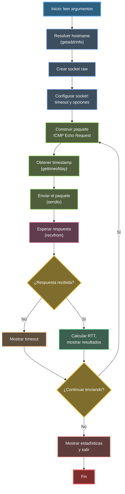

# Diagrama de Flujo - ft_ping

## Visualización

Para ver este diagrama correctamente:
- **VS Code**: Instala la extensión "Markdown Preview Mermaid Support" y abre la vista previa (Ctrl+Shift+V)
- **GitHub**: Se renderiza automáticamente
