# Diagrama de Flujo Completo - ft_ping

Este diagrama muestra todo el proceso completo de tu proyecto ft_ping, desde el inicio hasta el final, incluyendo todos los módulos y funciones principales.

```mermaid
flowchart TB
    Start([INICIO: main]) --> CheckRoot{¿Permisos root?}
    CheckRoot -->|No| ErrorRoot[Error: Requiere root]
    CheckRoot -->|Sí| SetupSignal[Configurar señales SIGINT/SIGALRM]
    ErrorRoot --> End1([FIN: Exit 1])
    
    SetupSignal --> ParseArgs[Parsear argumentos argc/argv]
    ParseArgs --> ValidateArgs{¿Argumentos válidos?}
    ValidateArgs -->|No| ShowHelp[Mostrar ayuda]
    ValidateArgs -->|Sí| SetDefaults[Establecer valores por defecto]
    ShowHelp --> End2([FIN: Exit 0])
    
    SetDefaults --> ProcessFlags[Procesar flags:<br/>-v -c -f -s --ttl -i -W]
    ProcessFlags --> GetTarget[Extraer destino hostname/IP]
    GetTarget --> HasTarget{¿Tiene destino?}
    HasTarget -->|No| ErrorDest[Error: Destino requerido]
    ErrorDest --> End3([FIN: Exit 2])
    
    HasTarget -->|Sí| SpecialIP{¿IP decimal<br/>especial?}
    SpecialIP -->|Sí| ConvertIP[Convertir formato IP<br/>192 → 0.0.0.192]
    SpecialIP -->|No| ResolveHost[Resolver hostname]
    ConvertIP --> ResolveHost
    
    ResolveHost --> TryIP{¿Es IP válida?}
    TryIP -->|Sí| UseIP[Usar IP directamente]
    TryIP -->|No| DNSLookup[getaddrinfo DNS lookup]
    DNSLookup --> DNSResult{¿Resuelto?}
    DNSResult -->|No| ErrorResolve[Error: No se pudo resolver]
    ErrorResolve --> End4([FIN: Exit 2])
    DNSResult -->|Sí| UseIP
    
    UseIP --> CreateSocket[Crear socket RAW ICMP]
    CreateSocket --> SocketOK{¿Socket OK?}
    SocketOK -->|No| ErrorSocket[Error: socket failed]
    ErrorSocket --> End5([FIN: Exit 1])
    
    SocketOK -->|Sí| ConfigSocket[Configurar socket]
    ConfigSocket --> SetTimeout[setsockopt SO_RCVTIMEO<br/>timeout: 500ms]
    SetTimeout --> CheckTTL{¿TTL personalizado?}
    CheckTTL -->|Sí| SetTTL[setsockopt IP_TTL]
    CheckTTL -->|No| InitStats[Inicializar estadísticas]
    SetTTL --> InitStats
    
    InitStats --> PrintBanner[Imprimir banner:<br/>PING target size bytes]
    PrintBanner --> SetupContext[Configurar contexto ping]
    SetupContext --> CheckCount{¿Límite -c?}
    CheckCount -->|Sí| SetMax[max_packets = count]
    CheckCount -->|No| SetInfinite[max_packets = 0 infinito]
    SetMax --> LoopStart
    SetInfinite --> LoopStart
    
    LoopStart{Loop: ¿Continuar?<br/>!g_stop && paquetes}
    LoopStart -->|No| ShowStats[Mostrar estadísticas finales]
    LoopStart -->|Sí| GetTime[gettimeofday send_time]
    
    GetTime --> BuildPacket[Construir paquete ICMP]
    BuildPacket --> SetHeader[type=8 code=0<br/>id=PID seq=counter]
    SetHeader --> FillData[Llenar payload:<br/>ft_ping payload data...]
    FillData --> CalcChecksum[Calcular checksum ICMP]
    CalcChecksum --> SendPacket[sendto paquete]
    SendPacket --> IncSent[packets_sent++]
    
    IncSent --> WaitReply[recvfrom esperar respuesta<br/>timeout 500ms]
    WaitReply --> GotReply{¿Respuesta?}
    GotReply -->|Timeout| ShowTimeout[Imprimir Request timeout]
    GotReply -->|Sí| GetRecvTime[gettimeofday recv_time]
    
    GetRecvTime --> ParseIP[Parsear IP header]
    ParseIP --> GetTTL[Extraer TTL del IP header]
    GetTTL --> SkipIP[Saltar IP header:<br/>buffer + ihl*4]
    SkipIP --> ParseICMP[Parsear ICMP header]
    
    ParseICMP --> CheckType{type del ICMP}
    CheckType -->|type=0 ECHOREPLY| ValidateID{¿ID coincide?}
    CheckType -->|type=3 Dest Unreach| ShowUnreach[Mostrar error:<br/>Host/Net Unreachable]
    CheckType -->|type=11 Time Exceed| ShowTTLExceed[Mostrar error:<br/>TTL exceeded]
    CheckType -->|type=5 Redirect| ShowRedirect[Mostrar Redirect]
    CheckType -->|Otro| IgnorePacket[Ignorar paquete]
    
    ShowUnreach --> ShowTimeout
    ShowTTLExceed --> ShowTimeout
    ShowRedirect --> ShowTimeout
    IgnorePacket --> WaitReply
    
    ValidateID -->|No coincide| IgnorePacket
    ValidateID -->|Coincide| CalcRTT[Calcular RTT:<br/>recv_time - send_time]
    CalcRTT --> IncRecv[packets_received++]
    IncRecv --> UpdateStats[Actualizar min/max/avg/mdev]
    UpdateStats --> PrintReply[Imprimir respuesta:<br/>bytes from IP seq ttl time]
    
    PrintReply --> CheckStop{¿g_stop?}
    ShowTimeout --> CheckStop
    CheckStop -->|Sí| ShowStats
    CheckStop -->|No| IncSeq[sequence++]
    
    IncSeq --> CheckFlood{¿Modo flood -f?}
    CheckFlood -->|Sí| LoopStart
    CheckFlood -->|No| CheckInterval{¿Intervalo -i?}
    CheckInterval -->|>= 1s| SleepSec[sleep segundos]
    CheckInterval -->|< 1s| SleepMicro[usleep microsegundos]
    SleepSec --> LoopStart
    SleepMicro --> LoopStart
    
    ShowStats --> CalcLoss[Calcular pérdida:<br/>packets_sent - packets_received]
    CalcLoss --> CalcPercent[Porcentaje pérdida]
    CalcPercent --> CalcTime[Calcular tiempo total]
    CalcTime --> PrintSummary[Imprimir:<br/>X transmitted Y received Z% loss]
    PrintSummary --> HasReceived{¿Recibidos > 0?}
    HasReceived -->|Sí| PrintRTT[Imprimir:<br/>rtt min/avg/max/mdev]
    HasReceived -->|No| CloseSocket
    PrintRTT --> CloseSocket[close socket]
    CloseSocket --> Cleanup[Liberar memoria args]
    Cleanup --> End([FIN: Exit 0])
    
    style Start fill:#2d5f7f,stroke:#5da9e9,stroke-width:3px,color:#fff
    style End fill:#2d7f2d,stroke:#5de95d,stroke-width:3px,color:#fff
    style End1 fill:#7f2d2d,stroke:#e95d5d,stroke-width:2px,color:#fff
    style End2 fill:#7f2d2d,stroke:#e95d5d,stroke-width:2px,color:#fff
    style End3 fill:#7f2d2d,stroke:#e95d5d,stroke-width:2px,color:#fff
    style End4 fill:#7f2d2d,stroke:#e95d5d,stroke-width:2px,color:#fff
    style End5 fill:#7f2d2d,stroke:#e95d5d,stroke-width:2px,color:#fff
    style CheckRoot fill:#7f6d2d,stroke:#e9c95d,stroke-width:2px,color:#fff
    style ValidateArgs fill:#7f6d2d,stroke:#e9c95d,stroke-width:2px,color:#fff
    style HasTarget fill:#7f6d2d,stroke:#e9c95d,stroke-width:2px,color:#fff
    style TryIP fill:#7f6d2d,stroke:#e9c95d,stroke-width:2px,color:#fff
    style DNSResult fill:#7f6d2d,stroke:#e9c95d,stroke-width:2px,color:#fff
    style SocketOK fill:#7f6d2d,stroke:#e9c95d,stroke-width:2px,color:#fff
    style CheckTTL fill:#7f6d2d,stroke:#e9c95d,stroke-width:2px,color:#fff
    style CheckCount fill:#7f6d2d,stroke:#e9c95d,stroke-width:2px,color:#fff
    style LoopStart fill:#5f3d7f,stroke:#a97de9,stroke-width:3px,color:#fff
    style GotReply fill:#7f6d2d,stroke:#e9c95d,stroke-width:2px,color:#fff
    style CheckType fill:#7f6d2d,stroke:#e9c95d,stroke-width:2px,color:#fff
    style ValidateID fill:#7f6d2d,stroke:#e9c95d,stroke-width:2px,color:#fff
    style CheckStop fill:#7f6d2d,stroke:#e9c95d,stroke-width:2px,color:#fff
    style CheckFlood fill:#7f6d2d,stroke:#e9c95d,stroke-width:2px,color:#fff
    style CheckInterval fill:#7f6d2d,stroke:#e9c95d,stroke-width:2px,color:#fff
    style HasReceived fill:#7f6d2d,stroke:#e9c95d,stroke-width:2px,color:#fff
    style SpecialIP fill:#7f6d2d,stroke:#e9c95d,stroke-width:2px,color:#fff
```



## 📋 Descripción de las Fases

### 1️⃣ **Fase de Inicialización**
- Verificación de permisos root (requerido para RAW socket)
- Configuración de señales (SIGINT para Ctrl+C)
- Parseo y validación de argumentos

### 2️⃣ **Fase de Configuración**
- Procesamiento de flags: `-v`, `-c`, `-f`, `-s`, `--ttl`, `-i`, `-W`
- Extracción del destino (hostname o IP)
- Resolución DNS con `getaddrinfo()`
- Manejo de IPs decimales especiales

### 3️⃣ **Fase de Preparación de Red**
- Creación del socket RAW ICMP
- Configuración de timeout (500ms)
- Configuración opcional de TTL
- Inicialización de estructuras de estadísticas

### 4️⃣ **Fase de Loop Principal**
- Construcción del paquete ICMP Echo Request
- Cálculo del checksum
- Envío con `sendto()`
- Espera de respuesta con `recvfrom()`
- Manejo de diferentes tipos de respuesta ICMP

### 5️⃣ **Fase de Procesamiento de Respuesta**
- Parseo del header IP (para extraer TTL)
- Parseo del header ICMP
- Validación de tipo y ID
- Cálculo del RTT (Round Trip Time)
- Actualización de estadísticas

### 6️⃣ **Fase de Control de Flujo**
- Verificación de señal de parada (Ctrl+C)
- Control de número de paquetes (`-c`)
- Gestión de intervalo entre paquetes (`-i`)
- Modo flood sin delays (`-f`)

### 7️⃣ **Fase de Finalización**
- Cálculo de estadísticas finales
- Cálculo de porcentaje de pérdida
- Impresión de resumen (min/avg/max/mdev)
- Cierre de socket y limpieza de memoria

## 🔑 Funciones Clave por Archivo

| Archivo | Funciones Principales |
|---------|----------------------|
| `ft_ping.c` | `main()`, `setup_handler()`, `start_ping_loop()` |
| `parse_args.c` | `parse_arguments()`, `check_all_flags()`, `get_target_from_args()` |
| `resolver.c` | `find_target_address()`, `check_if_ip()`, `find_hostname_ip()` |
| `socket.c` | `create_socket()`, `set_socket_ttl()`, `close_socket()` |
| `icmp_send.c` | `icmp_request()` |
| `icmp_recv.c` | `icmp_receive()` |
| `icmp_utils.c` | `icmp_checksum()` |
| `stats.c` | `setup_stats()`, `count_sent_packet()`, `count_got_packet()`, `print_final_stats()` |
| `signal.c` | `setup_signal_handler()`, `signal_handler()` |

## 📊 Estructuras de Datos

### `t_args`
Almacena todos los argumentos parseados:
- `target`: destino (hostname o IP)
- `packet_count`: número de paquetes (`-c`)
- `packet_bytes`: tamaño del payload (`-s`)
- `time_to_live`: TTL (`--ttl`)
- `mode_verbose`: salida detallada (`-v`)
- `flood_mode`: modo flood (`-f`)
- `interval`: intervalo entre paquetes (`-i`)
- `timeout`: timeout de respuesta (`-W`)

### `t_ping_stats`
Almacena estadísticas de ejecución:
- `packets_sent`: paquetes transmitidos
- `packets_got`: paquetes recibidos
- `fastest_time`: RTT mínimo
- `slowest_time`: RTT máximo
- `total_time`: suma de RTTs
- `total_time_squared`: suma de RTTs² (para mdev)
- `start_moment`, `end_moment`: timestamps

### `t_ping_context`
Contexto de ejecución:
- `socket_fd`: descriptor del socket
- `target_addr`: dirección destino
- `packet_id`: ID del paquete (PID)
- `packet_number`: número de secuencia
- `stats`: puntero a estadísticas
- `args`: puntero a argumentos

## 🌐 Protocolo ICMP

### Paquete ICMP Echo Request (enviado)
```
┌──────────┬──────────┬──────────┬──────────┐
│ Type (8) │ Code (0) │ Checksum │          │
├──────────┴──────────┴──────────┴──────────┤
│        ID (PID)      │   Sequence Number   │
├─────────────────────────────────────────── ┤
│              Payload Data                  │
│       ("ft_ping payload data...")          │
└────────────────────────────────────────────┘
```

### Paquete ICMP Echo Reply (recibido)
```
┌──────────────────────────────────────────┐
│         IP Header (20 bytes)             │
│  - TTL (usado para mostrar)              │
│  - Source IP                             │
├──────────────────────────────────────────┤
│ Type (0) │ Code (0) │ Checksum │        │
├──────────┴──────────┴──────────┴────────┤
│        ID (PID)      │   Sequence       │
├──────────────────────────────────────────┤
│         Payload Data (echo)              │
└──────────────────────────────────────────┘
```

## 🚨 Tipos de Error ICMP Manejados

| Type | Code | Nombre | Manejo |
|------|------|--------|--------|
| 0 | 0 | Echo Reply | ✅ Procesar RTT y mostrar |
| 3 | 0-5 | Destination Unreachable | ⚠️ Mostrar error específico |
| 5 | 0-3 | Redirect | ⚠️ Mostrar redirect |
| 11 | 0 | Time Exceeded (TTL) | ⚠️ Mostrar TTL exceeded |
| 12 | 0 | Parameter Problem | ⚠️ Mostrar error de parámetro |

## 📈 Cálculos Estadísticos

### RTT (Round Trip Time)
```
RTT = (recv_time.tv_sec - send_time.tv_sec) * 1000.0 +
      (recv_time.tv_usec - send_time.tv_usec) / 1000.0
```

### Pérdida de Paquetes
```
packet_loss = ((packets_sent - packets_got) / packets_sent) * 100.0
```

### Promedio RTT
```
avg_rtt = total_time / packets_got
```

### Desviación Estándar (mdev)
```
variance = (total_time_squared / packets_got) - (avg_rtt * avg_rtt)
mdev = sqrt(variance)
```

## 🎯 Casos de Uso

### Uso Básico
```bash
sudo ./ft_ping google.com
```

### Con Opciones
```bash
# Verbose + límite de paquetes
sudo ./ft_ping -v -c 5 8.8.8.8

# Tamaño personalizado + intervalo
sudo ./ft_ping -s 1000 -i 0.5 google.com

# Modo flood + TTL personalizado
sudo ./ft_ping -f --ttl 64 -c 100 8.8.8.8

# Timeout personalizado
sudo ./ft_ping -W 5 -c 3 example.com
```


